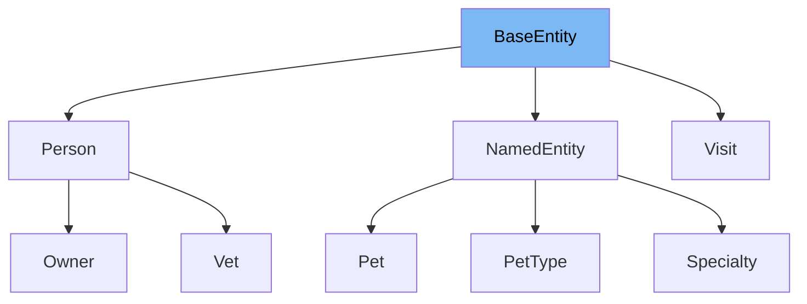

# Inheritance diagram

This diagram shows the inheritance tree of the class:



This document will cover the class <SwmToken path="src/main/java/org/springframework/samples/petclinic/model/BaseEntity.java" pos="33:4:4" line-data="public class BaseEntity implements Serializable {">`BaseEntity`</SwmToken> in the Spring PetClinic project. We'll explore:

1. What <SwmToken path="src/main/java/org/springframework/samples/petclinic/model/BaseEntity.java" pos="33:4:4" line-data="public class BaseEntity implements Serializable {">`BaseEntity`</SwmToken> is and its purpose.
2. The variables and functions defined in <SwmToken path="src/main/java/org/springframework/samples/petclinic/model/BaseEntity.java" pos="33:4:4" line-data="public class BaseEntity implements Serializable {">`BaseEntity`</SwmToken>.

# What is <SwmToken path="src/main/java/org/springframework/samples/petclinic/model/BaseEntity.java" pos="33:4:4" line-data="public class BaseEntity implements Serializable {">`BaseEntity`</SwmToken>

The <SwmToken path="src/main/java/org/springframework/samples/petclinic/model/BaseEntity.java" pos="33:4:4" line-data="public class BaseEntity implements Serializable {">`BaseEntity`</SwmToken> class is a simple <SwmToken path="src/main/java/org/springframework/samples/petclinic/model/BaseEntity.java" pos="26:5:5" line-data=" * Simple JavaBean domain object with an id property. Used as a base class for objects">`JavaBean`</SwmToken> domain object that serves as a base class for other objects requiring an <SwmToken path="src/main/java/org/springframework/samples/petclinic/model/BaseEntity.java" pos="40:3:3" line-data="		return id;">`id`</SwmToken> property. It is marked with the <SwmToken path="src/main/java/org/springframework/samples/petclinic/model/BaseEntity.java" pos="32:0:1" line-data="@MappedSuperclass">`@MappedSuperclass`</SwmToken> annotation, indicating that it is a superclass whose properties can be inherited by JPA entity classes. This class is used to provide a common <SwmToken path="src/main/java/org/springframework/samples/petclinic/model/BaseEntity.java" pos="40:3:3" line-data="		return id;">`id`</SwmToken> property to various entities within the application, facilitating the management of persistent objects.

<SwmSnippet path="/src/main/java/org/springframework/samples/petclinic/model/BaseEntity.java" line="39">

---

The function <SwmToken path="src/main/java/org/springframework/samples/petclinic/model/BaseEntity.java" pos="39:5:5" line-data="	public Integer getId() {">`getId`</SwmToken> is used to retrieve the <SwmToken path="src/main/java/org/springframework/samples/petclinic/model/BaseEntity.java" pos="40:3:3" line-data="		return id;">`id`</SwmToken> of the entity. It returns the <SwmToken path="src/main/java/org/springframework/samples/petclinic/model/BaseEntity.java" pos="40:3:3" line-data="		return id;">`id`</SwmToken> as an <SwmToken path="src/main/java/org/springframework/samples/petclinic/model/BaseEntity.java" pos="39:3:3" line-data="	public Integer getId() {">`Integer`</SwmToken>, allowing other parts of the application to access the unique identifier of the entity.

```java
	public Integer getId() {
		return id;
	}
```

---

</SwmSnippet>

<SwmSnippet path="/src/main/java/org/springframework/samples/petclinic/model/BaseEntity.java" line="43">

---

The function <SwmToken path="src/main/java/org/springframework/samples/petclinic/model/BaseEntity.java" pos="43:5:5" line-data="	public void setId(Integer id) {">`setId`</SwmToken> is used to set the <SwmToken path="src/main/java/org/springframework/samples/petclinic/model/BaseEntity.java" pos="43:9:9" line-data="	public void setId(Integer id) {">`id`</SwmToken> of the entity. It takes an <SwmToken path="src/main/java/org/springframework/samples/petclinic/model/BaseEntity.java" pos="43:7:7" line-data="	public void setId(Integer id) {">`Integer`</SwmToken> as a parameter and assigns it to the <SwmToken path="src/main/java/org/springframework/samples/petclinic/model/BaseEntity.java" pos="43:9:9" line-data="	public void setId(Integer id) {">`id`</SwmToken> field, enabling the modification of the entity's unique identifier.

```java
	public void setId(Integer id) {
		this.id = id;
	}
```

---

</SwmSnippet>

<SwmSnippet path="/src/main/java/org/springframework/samples/petclinic/model/BaseEntity.java" line="47">

---

The function <SwmToken path="src/main/java/org/springframework/samples/petclinic/model/BaseEntity.java" pos="47:5:5" line-data="	public boolean isNew() {">`isNew`</SwmToken> is used to determine if the entity is new, meaning it has not been persisted yet. It returns `true` if the <SwmToken path="src/main/java/org/springframework/samples/petclinic/model/BaseEntity.java" pos="48:5:5" line-data="		return this.id == null;">`id`</SwmToken> is <SwmToken path="src/main/java/org/springframework/samples/petclinic/model/BaseEntity.java" pos="48:9:9" line-data="		return this.id == null;">`null`</SwmToken>, indicating that the entity is not yet stored in the database.

```java
	public boolean isNew() {
		return this.id == null;
	}
```

---

</SwmSnippet>

# Usage

## PetClinicRuntimeHints

In `PetClinicRuntimeHints`, <SwmToken path="src/main/java/org/springframework/samples/petclinic/model/BaseEntity.java" pos="33:4:4" line-data="public class BaseEntity implements Serializable {">`BaseEntity`</SwmToken> is registered for serialization. This indicates that objects of classes extending <SwmToken path="src/main/java/org/springframework/samples/petclinic/model/BaseEntity.java" pos="33:4:4" line-data="public class BaseEntity implements Serializable {">`BaseEntity`</SwmToken> can be serialized, which is useful for converting objects into a format that can be easily stored or transmitted.

## Person

The `Person` class extends <SwmToken path="src/main/java/org/springframework/samples/petclinic/model/BaseEntity.java" pos="33:4:4" line-data="public class BaseEntity implements Serializable {">`BaseEntity`</SwmToken>, inheriting its properties and behaviors. This allows `Person` to have a unique identifier and be serialized, facilitating its use in database operations and data transfer.

## NamedEntity

Similarly, `NamedEntity` extends <SwmToken path="src/main/java/org/springframework/samples/petclinic/model/BaseEntity.java" pos="33:4:4" line-data="public class BaseEntity implements Serializable {">`BaseEntity`</SwmToken>, which provides it with serialization capabilities and a unique identifier. This is particularly useful for entities that need to be uniquely identified and stored in a database.

## Visit

The `Visit` class also extends <SwmToken path="src/main/java/org/springframework/samples/petclinic/model/BaseEntity.java" pos="33:4:4" line-data="public class BaseEntity implements Serializable {">`BaseEntity`</SwmToken>, allowing it to be an entity with a unique identifier and serialization capabilities. This is essential for managing visit records in the application, ensuring they can be stored and retrieved efficiently.

&nbsp;

*This is an auto-generated document by Swimm 🌊 and has not yet been verified by a human*

<SwmMeta version="3.0.0" repo-id="Z2l0aHViJTNBJTNBc3ByaW5nLXBldGNsaW5pYyUzQSUzQXVtYWxpbmdhc3dhbWk=" repo-name="spring-petclinic"><sup>Powered by [Swimm](/)</sup></SwmMeta>
