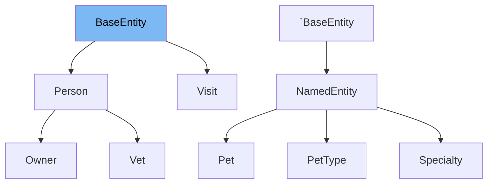

# Inheritance diagram

This diagram shows the inheritance tree of the class:



# What is <SwmToken path="/src/main/java/org/springframework/samples/petclinic/model/BaseEntity.java" pos="33:4:4" line-data="public class BaseEntity implements Serializable {">`BaseEntity`</SwmToken>

The <SwmToken path="/src/main/java/org/springframework/samples/petclinic/model/BaseEntity.java" pos="33:4:4" line-data="public class BaseEntity implements Serializable {">`BaseEntity`</SwmToken> class is a simple <SwmToken path="src/main/java/org/springframework/samples/petclinic/model/BaseEntity.java" pos="26:5:5" line-data=" * Simple JavaBean domain object with an id property. Used as a base class for objects">`JavaBean`</SwmToken> domain object with an <SwmToken path="src/main/java/org/springframework/samples/petclinic/model/BaseEntity.java" pos="40:3:3" line-data="		return id;">`id`</SwmToken> property. It serves as a base class for other objects that require this property, providing a common structure for entities in the application. The class is marked with <SwmToken path="src/main/java/org/springframework/samples/petclinic/model/BaseEntity.java" pos="32:0:1" line-data="@MappedSuperclass">`@MappedSuperclass`</SwmToken>, indicating that it is not a complete entity itself but provides mapping information for its subclasses.

<SwmSnippet path="/src/main/java/org/springframework/samples/petclinic/model/BaseEntity.java" line="39">

---

The function <SwmToken path="src/main/java/org/springframework/samples/petclinic/model/BaseEntity.java" pos="39:5:5" line-data="	public Integer getId() {">`getId`</SwmToken> is used to retrieve the value of the <SwmToken path="src/main/java/org/springframework/samples/petclinic/model/BaseEntity.java" pos="40:3:3" line-data="		return id;">`id`</SwmToken> property. It returns the <SwmToken path="src/main/java/org/springframework/samples/petclinic/model/BaseEntity.java" pos="40:3:3" line-data="		return id;">`id`</SwmToken> of the entity, which is an <SwmToken path="src/main/java/org/springframework/samples/petclinic/model/BaseEntity.java" pos="39:3:3" line-data="	public Integer getId() {">`Integer`</SwmToken>.

```java
	public Integer getId() {
		return id;
	}
```

---

</SwmSnippet>

<SwmSnippet path="/src/main/java/org/springframework/samples/petclinic/model/BaseEntity.java" line="43">

---

The function <SwmToken path="src/main/java/org/springframework/samples/petclinic/model/BaseEntity.java" pos="43:5:5" line-data="	public void setId(Integer id) {">`setId`</SwmToken> is used to set the value of the <SwmToken path="src/main/java/org/springframework/samples/petclinic/model/BaseEntity.java" pos="43:9:9" line-data="	public void setId(Integer id) {">`id`</SwmToken> property. It takes an <SwmToken path="src/main/java/org/springframework/samples/petclinic/model/BaseEntity.java" pos="43:7:7" line-data="	public void setId(Integer id) {">`Integer`</SwmToken> as a parameter and assigns it to the <SwmToken path="src/main/java/org/springframework/samples/petclinic/model/BaseEntity.java" pos="43:9:9" line-data="	public void setId(Integer id) {">`id`</SwmToken> field.

```java
	public void setId(Integer id) {
		this.id = id;
	}
```

---

</SwmSnippet>

<SwmSnippet path="/src/main/java/org/springframework/samples/petclinic/model/BaseEntity.java" line="47">

---

The function <SwmToken path="src/main/java/org/springframework/samples/petclinic/model/BaseEntity.java" pos="47:5:5" line-data="	public boolean isNew() {">`isNew`</SwmToken> checks whether the entity is new by determining if the <SwmToken path="src/main/java/org/springframework/samples/petclinic/model/BaseEntity.java" pos="48:5:5" line-data="		return this.id == null;">`id`</SwmToken> is <SwmToken path="src/main/java/org/springframework/samples/petclinic/model/BaseEntity.java" pos="48:9:9" line-data="		return this.id == null;">`null`</SwmToken>. It returns `true` if the <SwmToken path="src/main/java/org/springframework/samples/petclinic/model/BaseEntity.java" pos="48:5:5" line-data="		return this.id == null;">`id`</SwmToken> is <SwmToken path="src/main/java/org/springframework/samples/petclinic/model/BaseEntity.java" pos="48:9:9" line-data="		return this.id == null;">`null`</SwmToken>, indicating that the entity has not been persisted yet.

```java
	public boolean isNew() {
		return this.id == null;
	}
```

---

</SwmSnippet>

# Usage

&nbsp;

*This is an auto-generated document by Swimm 🌊 and has not yet been verified by a human*

<SwmMeta version="3.0.0" repo-id="Z2l0aHViJTNBJTNBc3ByaW5nLXBldGNsaW5pYyUzQSUzQXVtYWxpbmdhc3dhbWk=" repo-name="spring-petclinic"><sup>Powered by [Swimm](https://app.swimm.io/)</sup></SwmMeta>
