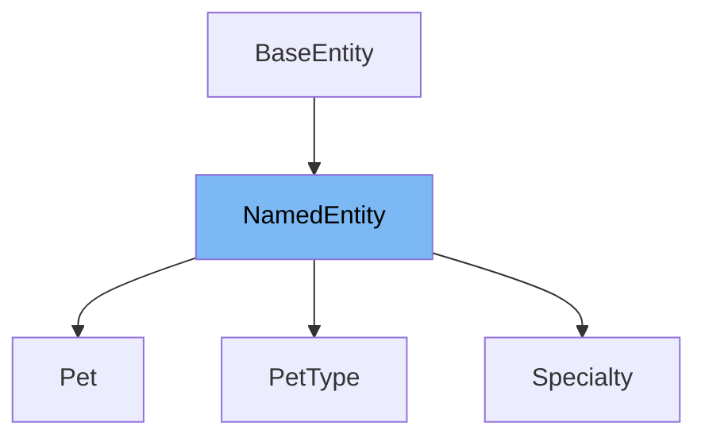

# Inheritance diagram

This diagram shows the inheritance tree of the class:



# What is <SwmToken path="src/main/java/org/springframework/samples/petclinic/vet/Vet.java" pos="62:8:8" line-data="			.sorted(Comparator.comparing(NamedEntity::getName))">`NamedEntity`</SwmToken>

The <SwmToken path="src/main/java/org/springframework/samples/petclinic/vet/Vet.java" pos="62:8:8" line-data="			.sorted(Comparator.comparing(NamedEntity::getName))">`NamedEntity`</SwmToken> class is a <SwmToken path="src/main/java/org/springframework/samples/petclinic/model/NamedEntity.java" pos="23:5:5" line-data=" * Simple JavaBean domain object adds a name property to &lt;code&gt;BaseEntity&lt;/code&gt;. Used as">`JavaBean`</SwmToken> domain object that extends <SwmToken path="src/main/java/org/springframework/samples/petclinic/model/NamedEntity.java" pos="23:24:24" line-data=" * Simple JavaBean domain object adds a name property to &lt;code&gt;BaseEntity&lt;/code&gt;. Used as">`BaseEntity`</SwmToken> and adds a <SwmToken path="src/main/java/org/springframework/samples/petclinic/model/NamedEntity.java" pos="38:5:5" line-data="		return this.name;">`name`</SwmToken> property. It serves as a base class for other entities in the application that require a name attribute, facilitating the management of named entities within the pet clinic system.

<SwmSnippet path="/src/main/java/org/springframework/samples/petclinic/model/NamedEntity.java" line="37">

---

The function <SwmToken path="src/main/java/org/springframework/samples/petclinic/model/NamedEntity.java" pos="37:5:5" line-data="	public String getName() {">`getName`</SwmToken> is used to retrieve the value of the <SwmToken path="src/main/java/org/springframework/samples/petclinic/model/NamedEntity.java" pos="38:5:5" line-data="		return this.name;">`name`</SwmToken> property from a <SwmToken path="src/main/java/org/springframework/samples/petclinic/vet/Vet.java" pos="62:8:8" line-data="			.sorted(Comparator.comparing(NamedEntity::getName))">`NamedEntity`</SwmToken> instance.

```java
	public String getName() {
		return this.name;
	}
```

---

</SwmSnippet>

<SwmSnippet path="/src/main/java/org/springframework/samples/petclinic/model/NamedEntity.java" line="41">

---

The function <SwmToken path="src/main/java/org/springframework/samples/petclinic/model/NamedEntity.java" pos="41:5:5" line-data="	public void setName(String name) {">`setName`</SwmToken> is used to assign a new value to the <SwmToken path="src/main/java/org/springframework/samples/petclinic/model/NamedEntity.java" pos="41:9:9" line-data="	public void setName(String name) {">`name`</SwmToken> property of a <SwmToken path="src/main/java/org/springframework/samples/petclinic/vet/Vet.java" pos="62:8:8" line-data="			.sorted(Comparator.comparing(NamedEntity::getName))">`NamedEntity`</SwmToken> instance.

```java
	public void setName(String name) {
		this.name = name;
	}
```

---

</SwmSnippet>

<SwmSnippet path="/src/main/java/org/springframework/samples/petclinic/model/NamedEntity.java" line="45">

---

The function <SwmToken path="src/main/java/org/springframework/samples/petclinic/model/NamedEntity.java" pos="46:5:5" line-data="	public String toString() {">`toString`</SwmToken> overrides the default <SwmToken path="src/main/java/org/springframework/samples/petclinic/model/NamedEntity.java" pos="46:5:5" line-data="	public String toString() {">`toString`</SwmToken> method to return the <SwmToken path="src/main/java/org/springframework/samples/petclinic/model/NamedEntity.java" pos="38:5:5" line-data="		return this.name;">`name`</SwmToken> property of the <SwmToken path="src/main/java/org/springframework/samples/petclinic/vet/Vet.java" pos="62:8:8" line-data="			.sorted(Comparator.comparing(NamedEntity::getName))">`NamedEntity`</SwmToken> instance, providing a string representation of the entity.

```java
	@Override
	public String toString() {
		return this.getName();
	}
```

---

</SwmSnippet>

# Usage

<SwmSnippet path="/src/main/java/org/springframework/samples/petclinic/vet/Vet.java" line="59">

---

In the <SwmToken path="src/main/java/org/springframework/samples/petclinic/vet/Vet.java" pos="45:4:4" line-data="public class Vet extends Person {">`Vet`</SwmToken> class, <SwmToken path="src/main/java/org/springframework/samples/petclinic/vet/Vet.java" pos="62:8:8" line-data="			.sorted(Comparator.comparing(NamedEntity::getName))">`NamedEntity`</SwmToken> is utilized to sort a list of <SwmToken path="src/main/java/org/springframework/samples/petclinic/vet/Vet.java" pos="60:5:5" line-data="	public List&lt;Specialty&gt; getSpecialties() {">`Specialty`</SwmToken> objects by their names. This is achieved using the <SwmToken path="src/main/java/org/springframework/samples/petclinic/vet/Vet.java" pos="62:4:6" line-data="			.sorted(Comparator.comparing(NamedEntity::getName))">`Comparator.comparing`</SwmToken> method, which leverages the <SwmToken path="src/main/java/org/springframework/samples/petclinic/vet/Vet.java" pos="62:10:10" line-data="			.sorted(Comparator.comparing(NamedEntity::getName))">`getName`</SwmToken> method from <SwmToken path="src/main/java/org/springframework/samples/petclinic/vet/Vet.java" pos="62:8:8" line-data="			.sorted(Comparator.comparing(NamedEntity::getName))">`NamedEntity`</SwmToken> to perform the sorting.

```java
	@XmlElement
	public List<Specialty> getSpecialties() {
		return getSpecialtiesInternal().stream()
			.sorted(Comparator.comparing(NamedEntity::getName))
			.collect(Collectors.toList());
```

---

</SwmSnippet>

<SwmSnippet path="/src/main/java/org/springframework/samples/petclinic/vet/Specialty.java" line="28">

---

The <SwmToken path="src/main/java/org/springframework/samples/petclinic/vet/Specialty.java" pos="30:4:4" line-data="public class Specialty extends NamedEntity {">`Specialty`</SwmToken> class extends <SwmToken path="src/main/java/org/springframework/samples/petclinic/vet/Specialty.java" pos="30:8:8" line-data="public class Specialty extends NamedEntity {">`NamedEntity`</SwmToken>, indicating that it inherits properties and behaviors from <SwmToken path="src/main/java/org/springframework/samples/petclinic/vet/Specialty.java" pos="30:8:8" line-data="public class Specialty extends NamedEntity {">`NamedEntity`</SwmToken>, such as having a name attribute that is not blank.

```java
@Entity
@Table(name = "specialties")
public class Specialty extends NamedEntity {
```

---

</SwmSnippet>

<SwmSnippet path="/src/main/java/org/springframework/samples/petclinic/owner/Pet.java" line="44">

---

Similarly, the <SwmToken path="src/main/java/org/springframework/samples/petclinic/owner/Pet.java" pos="46:4:4" line-data="public class Pet extends NamedEntity {">`Pet`</SwmToken> class extends <SwmToken path="src/main/java/org/springframework/samples/petclinic/owner/Pet.java" pos="46:8:8" line-data="public class Pet extends NamedEntity {">`NamedEntity`</SwmToken>, which means it also inherits the name attribute and other functionalities provided by <SwmToken path="src/main/java/org/springframework/samples/petclinic/owner/Pet.java" pos="46:8:8" line-data="public class Pet extends NamedEntity {">`NamedEntity`</SwmToken>. This allows <SwmToken path="src/main/java/org/springframework/samples/petclinic/owner/Pet.java" pos="46:4:4" line-data="public class Pet extends NamedEntity {">`Pet`</SwmToken> objects to have a name and other inherited properties.

```java
@Entity
@Table(name = "pets")
public class Pet extends NamedEntity {
```

---

</SwmSnippet>

<SwmSnippet path="/src/main/java/org/springframework/samples/petclinic/owner/PetType.java" line="26">

---

The <SwmToken path="src/main/java/org/springframework/samples/petclinic/owner/PetType.java" pos="28:4:4" line-data="public class PetType extends NamedEntity {">`PetType`</SwmToken> class is another example of a class extending <SwmToken path="src/main/java/org/springframework/samples/petclinic/owner/PetType.java" pos="28:8:8" line-data="public class PetType extends NamedEntity {">`NamedEntity`</SwmToken>. This inheritance allows <SwmToken path="src/main/java/org/springframework/samples/petclinic/owner/PetType.java" pos="28:4:4" line-data="public class PetType extends NamedEntity {">`PetType`</SwmToken> to utilize the name attribute and any other shared functionalities defined in <SwmToken path="src/main/java/org/springframework/samples/petclinic/owner/PetType.java" pos="28:8:8" line-data="public class PetType extends NamedEntity {">`NamedEntity`</SwmToken>.

```java
@Entity
@Table(name = "types")
public class PetType extends NamedEntity {
```

---

</SwmSnippet>

&nbsp;

*This is an auto-generated document by Swimm 🌊 and has not yet been verified by a human*

<SwmMeta version="3.0.0" repo-id="Z2l0aHViJTNBJTNBc3ByaW5nLXBldGNsaW5pYyUzQSUzQXVtYWxpbmdhc3dhbWk=" repo-name="spring-petclinic"><sup>Powered by [Swimm](/)</sup></SwmMeta>
