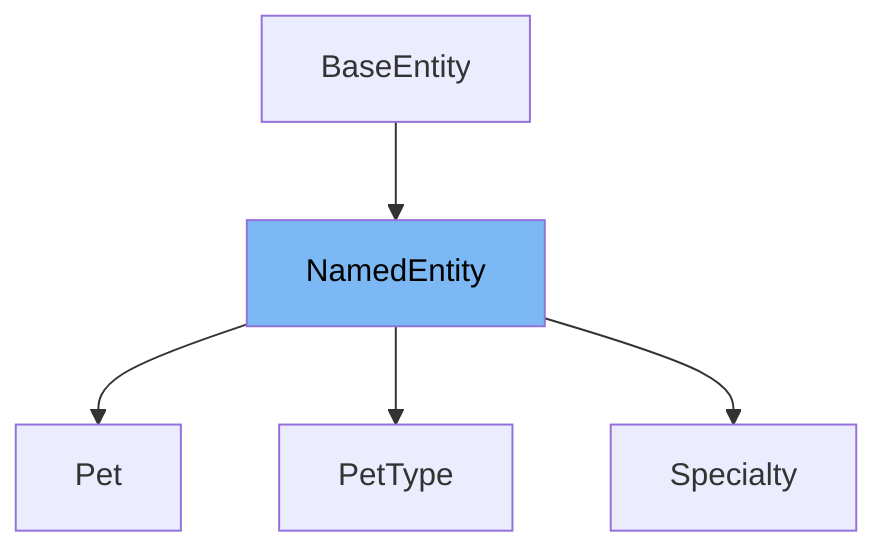

# Inheritance diagram

This diagram shows the inheritance tree of the class:



This document will cover the <SwmToken path="src/main/java/org/springframework/samples/petclinic/model/NamedEntity.java" pos="31:4:4" line-data="public class NamedEntity extends BaseEntity {">`NamedEntity`</SwmToken> class in the Spring PetClinic project. We will explore:

1. What <SwmToken path="src/main/java/org/springframework/samples/petclinic/model/NamedEntity.java" pos="31:4:4" line-data="public class NamedEntity extends BaseEntity {">`NamedEntity`</SwmToken> is and its purpose.
2. The variables and functions defined in <SwmToken path="src/main/java/org/springframework/samples/petclinic/model/NamedEntity.java" pos="31:4:4" line-data="public class NamedEntity extends BaseEntity {">`NamedEntity`</SwmToken>.

# What is <SwmToken path="src/main/java/org/springframework/samples/petclinic/model/NamedEntity.java" pos="31:4:4" line-data="public class NamedEntity extends BaseEntity {">`NamedEntity`</SwmToken>

<SwmToken path="src/main/java/org/springframework/samples/petclinic/model/NamedEntity.java" pos="31:4:4" line-data="public class NamedEntity extends BaseEntity {">`NamedEntity`</SwmToken> is a <SwmToken path="src/main/java/org/springframework/samples/petclinic/model/NamedEntity.java" pos="23:5:5" line-data=" * Simple JavaBean domain object adds a name property to &lt;code&gt;BaseEntity&lt;/code&gt;. Used as">`JavaBean`</SwmToken> domain object that extends <SwmToken path="src/main/java/org/springframework/samples/petclinic/model/NamedEntity.java" pos="23:24:24" line-data=" * Simple JavaBean domain object adds a name property to &lt;code&gt;BaseEntity&lt;/code&gt;. Used as">`BaseEntity`</SwmToken>, adding a name property. It serves as a base class for other entities that require a name attribute, facilitating code reuse and consistency across the application.

<SwmSnippet path="/src/main/java/org/springframework/samples/petclinic/model/NamedEntity.java" line="37">

---

The function <SwmToken path="src/main/java/org/springframework/samples/petclinic/model/NamedEntity.java" pos="37:5:5" line-data="	public String getName() {">`getName`</SwmToken> retrieves the value of the name property from the <SwmToken path="src/main/java/org/springframework/samples/petclinic/model/NamedEntity.java" pos="31:4:4" line-data="public class NamedEntity extends BaseEntity {">`NamedEntity`</SwmToken> class.

```java
	public String getName() {
		return this.name;
	}
```

---

</SwmSnippet>

<SwmSnippet path="/src/main/java/org/springframework/samples/petclinic/model/NamedEntity.java" line="41">

---

The function <SwmToken path="src/main/java/org/springframework/samples/petclinic/model/NamedEntity.java" pos="41:5:5" line-data="	public void setName(String name) {">`setName`</SwmToken> assigns a new value to the name property in the <SwmToken path="src/main/java/org/springframework/samples/petclinic/model/NamedEntity.java" pos="31:4:4" line-data="public class NamedEntity extends BaseEntity {">`NamedEntity`</SwmToken> class.

```java
	public void setName(String name) {
		this.name = name;
	}
```

---

</SwmSnippet>

<SwmSnippet path="/src/main/java/org/springframework/samples/petclinic/model/NamedEntity.java" line="45">

---

The function <SwmToken path="src/main/java/org/springframework/samples/petclinic/model/NamedEntity.java" pos="46:5:5" line-data="	public String toString() {">`toString`</SwmToken> returns the name property as a string representation of the <SwmToken path="src/main/java/org/springframework/samples/petclinic/model/NamedEntity.java" pos="31:4:4" line-data="public class NamedEntity extends BaseEntity {">`NamedEntity`</SwmToken> object.

```java
	@Override
	public String toString() {
		return this.getName();
	}
```

---

</SwmSnippet>

<SwmSnippet path="/src/main/java/org/springframework/samples/petclinic/model/NamedEntity.java" line="33">

---

The variable <SwmToken path="src/main/java/org/springframework/samples/petclinic/model/NamedEntity.java" pos="33:4:4" line-data="	@Column(name = &quot;name&quot;)">`name`</SwmToken> is a private string that stores the name of the entity. It is annotated with <SwmToken path="src/main/java/org/springframework/samples/petclinic/model/NamedEntity.java" pos="33:1:2" line-data="	@Column(name = &quot;name&quot;)">`@Column`</SwmToken> to map it to a database column and <SwmToken path="src/main/java/org/springframework/samples/petclinic/model/NamedEntity.java" pos="34:1:2" line-data="	@NotBlank">`@NotBlank`</SwmToken> to ensure it is not empty.

```java
	@Column(name = "name")
	@NotBlank
	private String name;
```

---

</SwmSnippet>

# Usage

## Pet

The `Pet` class extends <SwmToken path="src/main/java/org/springframework/samples/petclinic/model/NamedEntity.java" pos="31:4:4" line-data="public class NamedEntity extends BaseEntity {">`NamedEntity`</SwmToken>, indicating that each pet has a name attribute inherited from <SwmToken path="src/main/java/org/springframework/samples/petclinic/model/NamedEntity.java" pos="31:4:4" line-data="public class NamedEntity extends BaseEntity {">`NamedEntity`</SwmToken>. This class represents pets in the application, and it is mapped to the `pets` table in the database.

## PetType

The `PetType` class also extends <SwmToken path="src/main/java/org/springframework/samples/petclinic/model/NamedEntity.java" pos="31:4:4" line-data="public class NamedEntity extends BaseEntity {">`NamedEntity`</SwmToken>, which means it inherits the name attribute. This class is used to define different types of pets, and it is mapped to the `types` table in the database.

## Vet

In the `Vet` class, <SwmToken path="src/main/java/org/springframework/samples/petclinic/model/NamedEntity.java" pos="31:4:4" line-data="public class NamedEntity extends BaseEntity {">`NamedEntity`</SwmToken> is used to sort a list of specialties by name. This demonstrates how the name attribute from <SwmToken path="src/main/java/org/springframework/samples/petclinic/model/NamedEntity.java" pos="31:4:4" line-data="public class NamedEntity extends BaseEntity {">`NamedEntity`</SwmToken> can be utilized for sorting purposes.

## Specialty

The `Specialty` class extends <SwmToken path="src/main/java/org/springframework/samples/petclinic/model/NamedEntity.java" pos="31:4:4" line-data="public class NamedEntity extends BaseEntity {">`NamedEntity`</SwmToken>, inheriting the name attribute. This class represents the specialties of veterinarians and is mapped to the `specialties` table in the database.

&nbsp;

*This is an auto-generated document by Swimm 🌊 and has not yet been verified by a human*

<SwmMeta version="3.0.0" repo-id="Z2l0aHViJTNBJTNBc3ByaW5nLXBldGNsaW5pYyUzQSUzQXVtYWxpbmdhc3dhbWk=" repo-name="spring-petclinic"><sup>Powered by [Swimm](/)</sup></SwmMeta>
