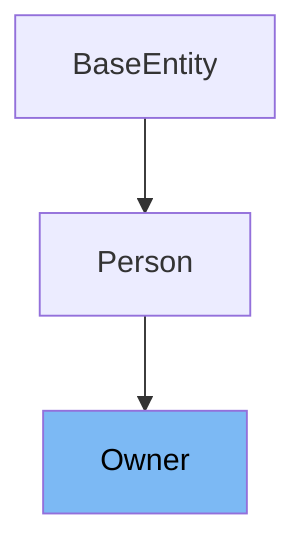

# Inheritance diagram

This diagram shows the inheritance tree of the class:



This document will cover the class <SwmToken path="src/main/java/org/springframework/samples/petclinic/owner/Owner.java" pos="48:4:4" line-data="public class Owner extends Person {">`Owner`</SwmToken> in the Spring PetClinic project. We'll explore:

1. What is <SwmToken path="src/main/java/org/springframework/samples/petclinic/owner/Owner.java" pos="48:4:4" line-data="public class Owner extends Person {">`Owner`</SwmToken>
2. Variables and functions within <SwmToken path="src/main/java/org/springframework/samples/petclinic/owner/Owner.java" pos="48:4:4" line-data="public class Owner extends Person {">`Owner`</SwmToken>

# What is Owner

The <SwmToken path="src/main/java/org/springframework/samples/petclinic/owner/Owner.java" pos="48:4:4" line-data="public class Owner extends Person {">`Owner`</SwmToken> class is a <SwmToken path="src/main/java/org/springframework/samples/petclinic/owner/Owner.java" pos="37:5:5" line-data=" * Simple JavaBean domain object representing an owner.">`JavaBean`</SwmToken> domain object representing an owner in the Spring PetClinic application. It extends the <SwmToken path="src/main/java/org/springframework/samples/petclinic/owner/Owner.java" pos="22:12:12" line-data="import org.springframework.samples.petclinic.model.Person;">`Person`</SwmToken> class and is annotated as an <SwmToken path="src/main/java/org/springframework/samples/petclinic/owner/Owner.java" pos="27:6:6" line-data="import jakarta.persistence.Entity;">`Entity`</SwmToken>, indicating that it is a JPA entity mapped to the <SwmToken path="src/main/java/org/springframework/samples/petclinic/owner/Owner.java" pos="47:8:8" line-data="@Table(name = &quot;owners&quot;)">`owners`</SwmToken> table in the database. The class is used to manage owner-related data, including personal information and associated pets.

<SwmSnippet path="/src/main/java/org/springframework/samples/petclinic/owner/Owner.java" line="68">

---

The function <SwmToken path="src/main/java/org/springframework/samples/petclinic/owner/Owner.java" pos="68:5:5" line-data="	public String getAddress() {">`getAddress`</SwmToken> retrieves the address of the owner.

```java
	public String getAddress() {
		return this.address;
	}
```

---

</SwmSnippet>

<SwmSnippet path="/src/main/java/org/springframework/samples/petclinic/owner/Owner.java" line="72">

---

The function <SwmToken path="src/main/java/org/springframework/samples/petclinic/owner/Owner.java" pos="72:5:5" line-data="	public void setAddress(String address) {">`setAddress`</SwmToken> sets the address of the owner.

```java
	public void setAddress(String address) {
		this.address = address;
	}
```

---

</SwmSnippet>

<SwmSnippet path="/src/main/java/org/springframework/samples/petclinic/owner/Owner.java" line="76">

---

The function <SwmToken path="src/main/java/org/springframework/samples/petclinic/owner/Owner.java" pos="76:5:5" line-data="	public String getCity() {">`getCity`</SwmToken> retrieves the city of the owner.

```java
	public String getCity() {
		return this.city;
	}
```

---

</SwmSnippet>

<SwmSnippet path="/src/main/java/org/springframework/samples/petclinic/owner/Owner.java" line="80">

---

The function <SwmToken path="src/main/java/org/springframework/samples/petclinic/owner/Owner.java" pos="80:5:5" line-data="	public void setCity(String city) {">`setCity`</SwmToken> sets the city of the owner.

```java
	public void setCity(String city) {
		this.city = city;
	}
```

---

</SwmSnippet>

<SwmSnippet path="/src/main/java/org/springframework/samples/petclinic/owner/Owner.java" line="84">

---

The function <SwmToken path="src/main/java/org/springframework/samples/petclinic/owner/Owner.java" pos="84:5:5" line-data="	public String getTelephone() {">`getTelephone`</SwmToken> retrieves the telephone number of the owner.

```java
	public String getTelephone() {
		return this.telephone;
	}
```

---

</SwmSnippet>

<SwmSnippet path="/src/main/java/org/springframework/samples/petclinic/owner/Owner.java" line="88">

---

The function <SwmToken path="src/main/java/org/springframework/samples/petclinic/owner/Owner.java" pos="88:5:5" line-data="	public void setTelephone(String telephone) {">`setTelephone`</SwmToken> sets the telephone number of the owner.

```java
	public void setTelephone(String telephone) {
		this.telephone = telephone;
	}
```

---

</SwmSnippet>

<SwmSnippet path="/src/main/java/org/springframework/samples/petclinic/owner/Owner.java" line="92">

---

The function <SwmToken path="src/main/java/org/springframework/samples/petclinic/owner/Owner.java" pos="92:8:8" line-data="	public List&lt;Pet&gt; getPets() {">`getPets`</SwmToken> retrieves the list of pets associated with the owner.

```java
	public List<Pet> getPets() {
		return this.pets;
	}
```

---

</SwmSnippet>

<SwmSnippet path="/src/main/java/org/springframework/samples/petclinic/owner/Owner.java" line="96">

---

The function <SwmToken path="src/main/java/org/springframework/samples/petclinic/owner/Owner.java" pos="96:5:5" line-data="	public void addPet(Pet pet) {">`addPet`</SwmToken> adds a new pet to the owner's list of pets if the pet is new.

```java
	public void addPet(Pet pet) {
		if (pet.isNew()) {
			getPets().add(pet);
		}
	}
```

---

</SwmSnippet>

<SwmSnippet path="/src/main/java/org/springframework/samples/petclinic/owner/Owner.java" line="107">

---

The function <SwmToken path="src/main/java/org/springframework/samples/petclinic/owner/Owner.java" pos="107:5:5" line-data="	public Pet getPet(String name) {">`getPet`</SwmToken> retrieves a pet by its name from the owner's list of pets.

```java
	public Pet getPet(String name) {
		return getPet(name, false);
	}
```

---

</SwmSnippet>

<SwmSnippet path="/src/main/java/org/springframework/samples/petclinic/owner/Owner.java" line="116">

---

The function <SwmToken path="src/main/java/org/springframework/samples/petclinic/owner/Owner.java" pos="116:5:5" line-data="	public Pet getPet(Integer id) {">`getPet`</SwmToken> retrieves a pet by its ID from the owner's list of pets.

```java
	public Pet getPet(Integer id) {
		for (Pet pet : getPets()) {
			if (!pet.isNew()) {
				Integer compId = pet.getId();
				if (compId.equals(id)) {
					return pet;
				}
			}
		}
		return null;
	}
```

---

</SwmSnippet>

<SwmSnippet path="/src/main/java/org/springframework/samples/petclinic/owner/Owner.java" line="134">

---

The function <SwmToken path="src/main/java/org/springframework/samples/petclinic/owner/Owner.java" pos="134:5:5" line-data="	public Pet getPet(String name, boolean ignoreNew) {">`getPet`</SwmToken> retrieves a pet by its name, with an option to ignore new pets.

```java
	public Pet getPet(String name, boolean ignoreNew) {
		for (Pet pet : getPets()) {
			String compName = pet.getName();
			if (compName != null && compName.equalsIgnoreCase(name)) {
				if (!ignoreNew || !pet.isNew()) {
					return pet;
				}
			}
		}
		return null;
	}
```

---

</SwmSnippet>

<SwmSnippet path="/src/main/java/org/springframework/samples/petclinic/owner/Owner.java" line="146">

---

The function <SwmToken path="src/main/java/org/springframework/samples/petclinic/owner/Owner.java" pos="147:5:5" line-data="	public String toString() {">`toString`</SwmToken> provides a string representation of the owner, including personal details and contact information.

```java
	@Override
	public String toString() {
		return new ToStringCreator(this).append("id", this.getId())
			.append("new", this.isNew())
			.append("lastName", this.getLastName())
			.append("firstName", this.getFirstName())
			.append("address", this.address)
			.append("city", this.city)
			.append("telephone", this.telephone)
			.toString();
	}
```

---

</SwmSnippet>

<SwmSnippet path="/src/main/java/org/springframework/samples/petclinic/owner/Owner.java" line="163">

---

The function <SwmToken path="src/main/java/org/springframework/samples/petclinic/owner/Owner.java" pos="163:5:5" line-data="	public void addVisit(Integer petId, Visit visit) {">`addVisit`</SwmToken> adds a visit to a pet identified by its ID.

```java
	public void addVisit(Integer petId, Visit visit) {

		Assert.notNull(petId, "Pet identifier must not be null!");
		Assert.notNull(visit, "Visit must not be null!");

		Pet pet = getPet(petId);

		Assert.notNull(pet, "Invalid Pet identifier!");

		pet.addVisit(visit);
	}
```

---

</SwmSnippet>

&nbsp;

*This is an auto-generated document by Swimm 🌊 and has not yet been verified by a human*

<SwmMeta version="3.0.0" repo-id="Z2l0aHViJTNBJTNBc3ByaW5nLXBldGNsaW5pYyUzQSUzQXVtYWxpbmdhc3dhbWk=" repo-name="spring-petclinic"><sup>Powered by [Swimm](/)</sup></SwmMeta>
