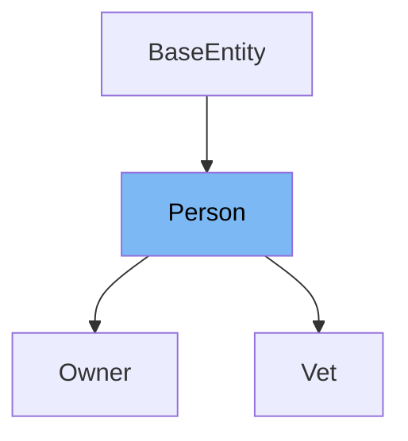

# Inheritance diagram

This diagram shows the inheritance tree of the class:



This document will cover the class Person in the Spring PetClinic project. We'll explore:

1. What Person is and its purpose.
2. Variables and functions defined in Person.

# What is Person

The <SwmToken path="src/main/java/org/springframework/samples/petclinic/model/Person.java" pos="28:4:4" line-data="public class Person extends BaseEntity {">`Person`</SwmToken> class is a simple <SwmToken path="src/main/java/org/springframework/samples/petclinic/model/Person.java" pos="23:5:5" line-data=" * Simple JavaBean domain object representing an person.">`JavaBean`</SwmToken> domain object representing a person within the Spring PetClinic application. It serves as a base class for other entities like `Owner` and `Vet`, providing common attributes such as first name and last name.

<SwmSnippet path="/src/main/java/org/springframework/samples/petclinic/model/Person.java" line="38">

---

The function <SwmToken path="src/main/java/org/springframework/samples/petclinic/model/Person.java" pos="38:5:5" line-data="	public String getFirstName() {">`getFirstName`</SwmToken> is used to retrieve the first name of the person. It returns the value of the <SwmToken path="src/main/java/org/springframework/samples/petclinic/model/Person.java" pos="39:5:5" line-data="		return this.firstName;">`firstName`</SwmToken> variable.

```java
	public String getFirstName() {
		return this.firstName;
	}
```

---

</SwmSnippet>

<SwmSnippet path="/src/main/java/org/springframework/samples/petclinic/model/Person.java" line="42">

---

The function <SwmToken path="src/main/java/org/springframework/samples/petclinic/model/Person.java" pos="42:5:5" line-data="	public void setFirstName(String firstName) {">`setFirstName`</SwmToken> is used to set the first name of the person. It assigns the provided value to the <SwmToken path="src/main/java/org/springframework/samples/petclinic/model/Person.java" pos="42:9:9" line-data="	public void setFirstName(String firstName) {">`firstName`</SwmToken> variable.

```java
	public void setFirstName(String firstName) {
		this.firstName = firstName;
	}
```

---

</SwmSnippet>

<SwmSnippet path="/src/main/java/org/springframework/samples/petclinic/model/Person.java" line="46">

---

The function <SwmToken path="src/main/java/org/springframework/samples/petclinic/model/Person.java" pos="46:5:5" line-data="	public String getLastName() {">`getLastName`</SwmToken> is used to retrieve the last name of the person. It returns the value of the <SwmToken path="src/main/java/org/springframework/samples/petclinic/model/Person.java" pos="47:5:5" line-data="		return this.lastName;">`lastName`</SwmToken> variable.

```java
	public String getLastName() {
		return this.lastName;
	}
```

---

</SwmSnippet>

<SwmSnippet path="/src/main/java/org/springframework/samples/petclinic/model/Person.java" line="50">

---

The function <SwmToken path="src/main/java/org/springframework/samples/petclinic/model/Person.java" pos="50:5:5" line-data="	public void setLastName(String lastName) {">`setLastName`</SwmToken> is used to set the last name of the person. It assigns the provided value to the <SwmToken path="src/main/java/org/springframework/samples/petclinic/model/Person.java" pos="50:9:9" line-data="	public void setLastName(String lastName) {">`lastName`</SwmToken> variable.

```java
	public void setLastName(String lastName) {
		this.lastName = lastName;
	}
```

---

</SwmSnippet>

<SwmSnippet path="/src/main/java/org/springframework/samples/petclinic/model/Person.java" line="30">

---

The variable <SwmToken path="src/main/java/org/springframework/samples/petclinic/model/Person.java" pos="32:5:5" line-data="	private String firstName;">`firstName`</SwmToken> is used to store the first name of the person. It is annotated with <SwmToken path="src/main/java/org/springframework/samples/petclinic/model/Person.java" pos="30:1:2" line-data="	@Column(name = &quot;first_name&quot;)">`@Column`</SwmToken> to map it to the database column <SwmToken path="src/main/java/org/springframework/samples/petclinic/model/Person.java" pos="30:9:9" line-data="	@Column(name = &quot;first_name&quot;)">`first_name`</SwmToken> and <SwmToken path="src/main/java/org/springframework/samples/petclinic/model/Person.java" pos="31:1:2" line-data="	@NotBlank">`@NotBlank`</SwmToken> to ensure it is not empty.

```java
	@Column(name = "first_name")
	@NotBlank
	private String firstName;
```

---

</SwmSnippet>

<SwmSnippet path="/src/main/java/org/springframework/samples/petclinic/model/Person.java" line="34">

---

The variable <SwmToken path="src/main/java/org/springframework/samples/petclinic/model/Person.java" pos="36:5:5" line-data="	private String lastName;">`lastName`</SwmToken> is used to store the last name of the person. It is annotated with <SwmToken path="src/main/java/org/springframework/samples/petclinic/model/Person.java" pos="34:1:2" line-data="	@Column(name = &quot;last_name&quot;)">`@Column`</SwmToken> to map it to the database column <SwmToken path="src/main/java/org/springframework/samples/petclinic/model/Person.java" pos="34:9:9" line-data="	@Column(name = &quot;last_name&quot;)">`last_name`</SwmToken> and <SwmToken path="src/main/java/org/springframework/samples/petclinic/model/Person.java" pos="35:1:2" line-data="	@NotBlank">`@NotBlank`</SwmToken> to ensure it is not empty.

```java
	@Column(name = "last_name")
	@NotBlank
	private String lastName;
```

---

</SwmSnippet>

# Usage

## PetClinicRuntimeHints

In `PetClinicRuntimeHints`, the <SwmToken path="src/main/java/org/springframework/samples/petclinic/model/Person.java" pos="28:4:4" line-data="public class Person extends BaseEntity {">`Person`</SwmToken> class is registered for serialization. This indicates that instances of <SwmToken path="src/main/java/org/springframework/samples/petclinic/model/Person.java" pos="28:4:4" line-data="public class Person extends BaseEntity {">`Person`</SwmToken> can be serialized, which is useful for converting objects into a format that can be easily stored or transmitted.

## Vet

The `Vet` class extends <SwmToken path="src/main/java/org/springframework/samples/petclinic/model/Person.java" pos="28:4:4" line-data="public class Person extends BaseEntity {">`Person`</SwmToken>, meaning it inherits properties and methods from <SwmToken path="src/main/java/org/springframework/samples/petclinic/model/Person.java" pos="28:4:4" line-data="public class Person extends BaseEntity {">`Person`</SwmToken>. This allows `Vet` to utilize common attributes like name and ID, while also adding specific attributes and behaviors related to veterinary professionals.

## Owner

Similarly, the `Owner` class extends <SwmToken path="src/main/java/org/springframework/samples/petclinic/model/Person.java" pos="28:4:4" line-data="public class Person extends BaseEntity {">`Person`</SwmToken>, inheriting its attributes. This enables `Owner` to represent individuals who own pets, incorporating both general person attributes and specific owner-related details.

&nbsp;

*This is an auto-generated document by Swimm 🌊 and has not yet been verified by a human*

<SwmMeta version="3.0.0" repo-id="Z2l0aHViJTNBJTNBc3ByaW5nLXBldGNsaW5pYyUzQSUzQXVtYWxpbmdhc3dhbWk=" repo-name="spring-petclinic"><sup>Powered by [Swimm](/)</sup></SwmMeta>
