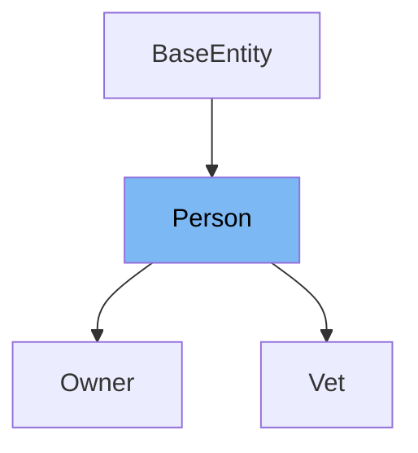

# Inheritance diagram

This diagram shows the inheritance tree of the class:



# What is Person

The <SwmToken path="src/main/java/org/springframework/samples/petclinic/model/Person.java" pos="28:4:4" line-data="public class Person extends BaseEntity {">`Person`</SwmToken> class in <SwmPath>[src/…/model/Person.java](src/main/java/org/springframework/samples/petclinic/model/Person.java)</SwmPath> is a simple <SwmToken path="src/main/java/org/springframework/samples/petclinic/model/Person.java" pos="23:5:5" line-data=" * Simple JavaBean domain object representing an person.">`JavaBean`</SwmToken> domain object representing a person. It serves as a base class for other entities like `Owner` and `Vet`, providing common attributes such as <SwmToken path="/src/main/java/org/springframework/samples/petclinic/model/Person.java" pos="45:5:5" line-data="		return this.firstName;">`firstName`</SwmToken> and <SwmToken path="/src/main/java/org/springframework/samples/petclinic/model/Person.java" pos="63:5:5" line-data="		return this.lastName;">`lastName`</SwmToken>.

<SwmSnippet path="src/main/java/org/springframework/samples/petclinic/model/Person.java" line="43">

---

The function <SwmToken path="/src/main/java/org/springframework/samples/petclinic/model/Person.java" pos="43:5:5" line-data="	public String getFirstName() {">`getFirstName`</SwmToken> is used to retrieve the first name of the person. It returns the value of the <SwmToken path="/src/main/java/org/springframework/samples/petclinic/model/Person.java" pos="45:5:5" line-data="		return this.firstName;">`firstName`</SwmToken> variable.

```java
	public String getFirstName() {
		logger.info("getFirstName called");
		return this.firstName;
	}

```

---

</SwmSnippet>

<SwmSnippet path="/src/main/java/org/springframework/samples/petclinic/model/Person.java" line="58">

---

The function <SwmToken path="/src/main/java/org/springframework/samples/petclinic/model/Person.java" pos="58:5:5" line-data="	public void setFirstName(String firstName) {">`setFirstName`</SwmToken> is used to set the first name of the person. It assigns the given value to the <SwmToken path="/src/main/java/org/springframework/samples/petclinic/model/Person.java" pos="58:9:9" line-data="	public void setFirstName(String firstName) {">`firstName`</SwmToken> variable.

```java
	public void setFirstName(String firstName) {
		this.firstName = firstName;
	}
```

---

</SwmSnippet>

<SwmSnippet path="/src/main/java/org/springframework/samples/petclinic/model/Person.java" line="62">

---

The function <SwmToken path="/src/main/java/org/springframework/samples/petclinic/model/Person.java" pos="62:5:5" line-data="	public String getLastName() {">`getLastName`</SwmToken> is used to retrieve the last name of the person. It returns the value of the <SwmToken path="/src/main/java/org/springframework/samples/petclinic/model/Person.java" pos="63:5:5" line-data="		return this.lastName;">`lastName`</SwmToken> variable.

```java
	public String getLastName() {
		return this.lastName;
	}
```

---

</SwmSnippet>

<SwmSnippet path="/src/main/java/org/springframework/samples/petclinic/model/Person.java" line="66">

---

The function <SwmToken path="/src/main/java/org/springframework/samples/petclinic/model/Person.java" pos="66:5:5" line-data="	public void setLastName(String lastName) {">`setLastName`</SwmToken> is used to set the last name of the person. It assigns the given value to the <SwmToken path="/src/main/java/org/springframework/samples/petclinic/model/Person.java" pos="66:9:9" line-data="	public void setLastName(String lastName) {">`lastName`</SwmToken> variable.

```java
	public void setLastName(String lastName) {
		this.lastName = lastName;
	}
```

---

</SwmSnippet>

# Usage

## PetClinicRuntimeHints

In `PetClinicRuntimeHints`, the <SwmToken path="src/main/java/org/springframework/samples/petclinic/model/Person.java" pos="28:4:4" line-data="public class Person extends BaseEntity {">`Person`</SwmToken> class is registered for serialization. This indicates that instances of <SwmToken path="src/main/java/org/springframework/samples/petclinic/model/Person.java" pos="28:4:4" line-data="public class Person extends BaseEntity {">`Person`</SwmToken> can be serialized, which is useful for converting objects into a format that can be easily stored or transmitted.

## Vet

The `Vet` class extends <SwmToken path="src/main/java/org/springframework/samples/petclinic/model/Person.java" pos="28:4:4" line-data="public class Person extends BaseEntity {">`Person`</SwmToken>, meaning it inherits properties and methods from <SwmToken path="src/main/java/org/springframework/samples/petclinic/model/Person.java" pos="28:4:4" line-data="public class Person extends BaseEntity {">`Person`</SwmToken>. This allows `Vet` to represent a veterinary professional with attributes such as name, which are defined in <SwmToken path="src/main/java/org/springframework/samples/petclinic/model/Person.java" pos="28:4:4" line-data="public class Person extends BaseEntity {">`Person`</SwmToken>.

## Owner

Similarly, the `Owner` class extends <SwmToken path="src/main/java/org/springframework/samples/petclinic/model/Person.java" pos="28:4:4" line-data="public class Person extends BaseEntity {">`Person`</SwmToken>, enabling it to represent a pet owner with personal attributes like name and address. This inheritance facilitates the reuse of common properties across different entities.

&nbsp;

*This is an auto-generated document by Swimm 🌊 and has not yet been verified by a human*

<SwmMeta version="3.0.0" repo-id="Z2l0aHViJTNBJTNBc3ByaW5nLXBldGNsaW5pYyUzQSUzQXVtYWxpbmdhc3dhbWk=" repo-name="spring-petclinic"><sup>Powered by [Swimm](https://app.swimm.io/)</sup></SwmMeta>
