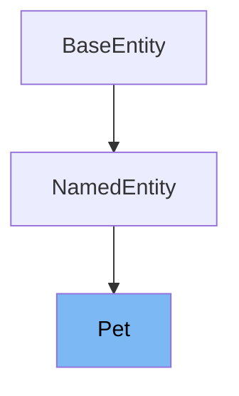

# Inheritance diagram

This diagram shows the inheritance tree of the class:



This document will cover the class <SwmToken path="src\main\java\org\springframework\samples\petclinic\owner\PetController.java" pos="72:3:3" line-data="	public Pet findPet(@PathVariable(&quot;ownerId&quot;) int ownerId,">`Pet`</SwmToken> in the Spring PetClinic project. We'll explore:

1. What the <SwmToken path="src\main\java\org\springframework\samples\petclinic\owner\PetController.java" pos="72:3:3" line-data="	public Pet findPet(@PathVariable(&quot;ownerId&quot;) int ownerId,">`Pet`</SwmToken> class is and its purpose.
2. The variables and functions defined within the <SwmToken path="src\main\java\org\springframework\samples\petclinic\owner\PetController.java" pos="72:3:3" line-data="	public Pet findPet(@PathVariable(&quot;ownerId&quot;) int ownerId,">`Pet`</SwmToken> class.

# What is Pet

The <SwmToken path="src\main\java\org\springframework\samples\petclinic\owner\PetController.java" pos="72:3:3" line-data="	public Pet findPet(@PathVariable(&quot;ownerId&quot;) int ownerId,">`Pet`</SwmToken> class in <SwmPath>[src/…/owner/Pet.java](src/main/java/org/springframework/samples/petclinic/owner/Pet.java)</SwmPath> represents a simple business object for a pet within the PetClinic application. It extends the <SwmToken path="src/main/java/org/springframework/samples/petclinic/owner/Pet.java" pos="24:12:12" line-data="import org.springframework.samples.petclinic.model.NamedEntity;">`NamedEntity`</SwmToken> class, inheriting properties that allow it to be uniquely identified by a name. The <SwmToken path="src\main\java\org\springframework\samples\petclinic\owner\PetController.java" pos="72:3:3" line-data="	public Pet findPet(@PathVariable(&quot;ownerId&quot;) int ownerId,">`Pet`</SwmToken> class is used to store and manage information related to pets, such as their birth date, type, and visits.

<SwmSnippet path="/src/main/java/org/springframework/samples/petclinic/owner/Pet.java" line="61">

---

The function <SwmToken path="src/main/java/org/springframework/samples/petclinic/owner/Pet.java" pos="61:5:5" line-data="	public void setBirthDate(LocalDate birthDate) {">`setBirthDate`</SwmToken> is used to set the birth date of the pet. It takes a <SwmToken path="src/main/java/org/springframework/samples/petclinic/owner/Pet.java" pos="61:7:7" line-data="	public void setBirthDate(LocalDate birthDate) {">`LocalDate`</SwmToken> object as a parameter and assigns it to the <SwmToken path="src/main/java/org/springframework/samples/petclinic/owner/Pet.java" pos="61:9:9" line-data="	public void setBirthDate(LocalDate birthDate) {">`birthDate`</SwmToken> variable.

```java
	public void setBirthDate(LocalDate birthDate) {
		this.birthDate = birthDate;
	}
```

---

</SwmSnippet>

<SwmSnippet path="/src/main/java/org/springframework/samples/petclinic/owner/Pet.java" line="65">

---

The function <SwmToken path="src/main/java/org/springframework/samples/petclinic/owner/Pet.java" pos="65:5:5" line-data="	public LocalDate getBirthDate() {">`getBirthDate`</SwmToken> returns the birth date of the pet. It retrieves the value stored in the <SwmToken path="src/main/java/org/springframework/samples/petclinic/owner/Pet.java" pos="66:5:5" line-data="		return this.birthDate;">`birthDate`</SwmToken> variable.

```java
	public LocalDate getBirthDate() {
		return this.birthDate;
	}
```

---

</SwmSnippet>

<SwmSnippet path="/src/main/java/org/springframework/samples/petclinic/owner/Pet.java" line="69">

---

The function <SwmToken path="src/main/java/org/springframework/samples/petclinic/owner/Pet.java" pos="69:5:5" line-data="	public PetType getType() {">`getType`</SwmToken> returns the type of the pet. It retrieves the value stored in the <SwmToken path="src/main/java/org/springframework/samples/petclinic/owner/Pet.java" pos="70:5:5" line-data="		return this.type;">`type`</SwmToken> variable, which is a <SwmToken path="src/main/java/org/springframework/samples/petclinic/owner/Pet.java" pos="69:3:3" line-data="	public PetType getType() {">`PetType`</SwmToken> object.

```java
	public PetType getType() {
		return this.type;
	}
```

---

</SwmSnippet>

<SwmSnippet path="/src/main/java/org/springframework/samples/petclinic/owner/Pet.java" line="73">

---

The function <SwmToken path="src/main/java/org/springframework/samples/petclinic/owner/Pet.java" pos="73:5:5" line-data="	public void setType(PetType type) {">`setType`</SwmToken> is used to set the type of the pet. It takes a <SwmToken path="src/main/java/org/springframework/samples/petclinic/owner/Pet.java" pos="73:7:7" line-data="	public void setType(PetType type) {">`PetType`</SwmToken> object as a parameter and assigns it to the <SwmToken path="src/main/java/org/springframework/samples/petclinic/owner/Pet.java" pos="73:9:9" line-data="	public void setType(PetType type) {">`type`</SwmToken> variable.

```java
	public void setType(PetType type) {
		this.type = type;
	}
```

---

</SwmSnippet>

<SwmSnippet path="/src/main/java/org/springframework/samples/petclinic/owner/Pet.java" line="77">

---

The function <SwmToken path="src/main/java/org/springframework/samples/petclinic/owner/Pet.java" pos="77:8:8" line-data="	public Collection&lt;Visit&gt; getVisits() {">`getVisits`</SwmToken> returns a collection of visits associated with the pet. It retrieves the <SwmToken path="src/main/java/org/springframework/samples/petclinic/owner/Pet.java" pos="78:5:5" line-data="		return this.visits;">`visits`</SwmToken> variable, which is a set of <SwmToken path="src/main/java/org/springframework/samples/petclinic/owner/Pet.java" pos="77:5:5" line-data="	public Collection&lt;Visit&gt; getVisits() {">`Visit`</SwmToken> objects.

```java
	public Collection<Visit> getVisits() {
		return this.visits;
	}
```

---

</SwmSnippet>

<SwmSnippet path="/src/main/java/org/springframework/samples/petclinic/owner/Pet.java" line="81">

---

The function <SwmToken path="src/main/java/org/springframework/samples/petclinic/owner/Pet.java" pos="81:5:5" line-data="	public void addVisit(Visit visit) {">`addVisit`</SwmToken> adds a new visit to the pet's collection of visits. It takes a <SwmToken path="src/main/java/org/springframework/samples/petclinic/owner/Pet.java" pos="81:7:7" line-data="	public void addVisit(Visit visit) {">`Visit`</SwmToken> object as a parameter and adds it to the <SwmToken path="src/main/java/org/springframework/samples/petclinic/owner/Pet.java" pos="78:5:5" line-data="		return this.visits;">`visits`</SwmToken> set.

```java
	public void addVisit(Visit visit) {
		getVisits().add(visit);
	}
```

---

</SwmSnippet>

# Usage

<SwmSnippet path="/src\main\java\org\springframework\samples\petclinic\owner\PetController.java" line="69">

---

In the <SwmToken path="src\main\java\org\springframework\samples\petclinic\owner\PetController.java" pos="45:2:2" line-data="class PetController {">`PetController`</SwmToken>, the <SwmToken path="src\main\java\org\springframework\samples\petclinic\owner\PetController.java" pos="72:3:3" line-data="	public Pet findPet(@PathVariable(&quot;ownerId&quot;) int ownerId,">`Pet`</SwmToken> class is used to manage pet-related operations. It is instantiated when initializing the creation form for a new pet, allowing the owner to add a new pet to their list. Additionally, the <SwmToken path="src\main\java\org\springframework\samples\petclinic\owner\PetController.java" pos="72:3:3" line-data="	public Pet findPet(@PathVariable(&quot;ownerId&quot;) int ownerId,">`Pet`</SwmToken> class is used to find a pet by its ID, facilitating the retrieval of pet information for display or update purposes.

```java
	}

	@ModelAttribute("pet")
	public Pet findPet(@PathVariable("ownerId") int ownerId,
			@PathVariable(name = "petId", required = false) Integer petId) {

		if (petId == null) {
			return new Pet();
		}

		Optional<Owner> optionalOwner = this.owners.findById(ownerId);
		Owner owner = optionalOwner.orElseThrow(() -> new IllegalArgumentException(
				"Owner not found with id: " + ownerId + ". Please ensure the ID is correct "));
		return owner.getPet(petId);
	}

	@InitBinder("owner")
	public void initOwnerBinder(WebDataBinder dataBinder) {
		dataBinder.setDisallowedFields("id");
	}

	@InitBinder("pet")
	public void initPetBinder(WebDataBinder dataBinder) {
		dataBinder.setValidator(new PetValidator());
	}

	@GetMapping("/pets/new")
	public String initCreationForm(Owner owner, ModelMap model) {
		Pet pet = new Pet();
		owner.addPet(pet);
		return VIEWS_PETS_CREATE_OR_UPDATE_FORM;
	}

	@PostMapping("/pets/new")
	public String processCreationForm(Owner owner, @Valid Pet pet, BindingResult result,
			RedirectAttributes redirectAttributes) {

		if (StringUtils.hasText(pet.getName()) && pet.isNew() && owner.getPet(pet.getName(), true) != null)
```

---

</SwmSnippet>

<SwmSnippet path="/src\main\java\org\springframework\samples\petclinic\owner\Owner.java" line="63">

---

Within the <SwmToken path="src\main\java\org\springframework\samples\petclinic\owner\Owner.java" pos="103:32:32" line-data="	 * Return the Pet with the given name, or null if none found for this Owner.">`Owner`</SwmToken> class, the <SwmToken path="src\main\java\org\springframework\samples\petclinic\owner\Owner.java" pos="66:7:7" line-data="	private final List&lt;Pet&gt; pets = new ArrayList&lt;&gt;();">`Pet`</SwmToken> class is used to represent the pets owned by an individual. The <SwmToken path="src\main\java\org\springframework\samples\petclinic\owner\Owner.java" pos="103:32:32" line-data="	 * Return the Pet with the given name, or null if none found for this Owner.">`Owner`</SwmToken> class maintains a list of <SwmToken path="src\main\java\org\springframework\samples\petclinic\owner\Owner.java" pos="66:7:7" line-data="	private final List&lt;Pet&gt; pets = new ArrayList&lt;&gt;();">`Pet`</SwmToken> instances, allowing for operations such as adding a new pet and retrieving a pet by name. This relationship is crucial for associating pets with their respective owners.

```java
	@OneToMany(cascade = CascadeType.ALL, fetch = FetchType.EAGER)
	@JoinColumn(name = "owner_id")
	@OrderBy("name")
	private final List<Pet> pets = new ArrayList<>();

	public String getAddress() {
		return this.address;
	}

	public void setAddress(String address) {
		this.address = address;
	}

	public String getCity() {
		return this.city;
	}

	public void setCity(String city) {
		this.city = city;
	}

	public String getTelephone() {
		return this.telephone;
	}

	public void setTelephone(String telephone) {
		this.telephone = telephone;
	}

	public List<Pet> getPets() {
		return this.pets;
	}

	public void addPet(Pet pet) {
		if (pet.isNew()) {
			getPets().add(pet);
		}
	}

	/**
	 * Return the Pet with the given name, or null if none found for this Owner.
	 * @param name to test
	 * @return the Pet with the given name, or null if no such Pet exists for this Owner
	 */
	public Pet getPet(String name) {
```

---

</SwmSnippet>

<SwmSnippet path="/src\main\java\org\springframework\samples\petclinic\owner\PetValidator.java" line="36">

---

The <SwmToken path="src\main\java\org\springframework\samples\petclinic\owner\PetController.java" pos="92:7:7" line-data="		dataBinder.setValidator(new PetValidator());">`PetValidator`</SwmToken> class is responsible for validating <SwmToken path="src\main\java\org\springframework\samples\petclinic\owner\PetValidator.java" pos="38:1:1" line-data="		Pet pet = (Pet) obj;">`Pet`</SwmToken> instances. It ensures that the pet's name is not empty and supports validation specifically for the <SwmToken path="src\main\java\org\springframework\samples\petclinic\owner\PetValidator.java" pos="38:1:1" line-data="		Pet pet = (Pet) obj;">`Pet`</SwmToken> class. This validation process is essential for maintaining data integrity and ensuring that all pet entries meet the required criteria.

```java
	@Override
	public void validate(Object obj, Errors errors) {
		Pet pet = (Pet) obj;
		String name = pet.getName();
		// name validation
		if (!StringUtils.hasText(name)) {
			errors.rejectValue("name", REQUIRED, REQUIRED);
		}

		// type validation
		if (pet.isNew() && pet.getType() == null) {
			errors.rejectValue("type", REQUIRED, REQUIRED);
		}

		// birth date validation
		if (pet.getBirthDate() == null) {
			errors.rejectValue("birthDate", REQUIRED, REQUIRED);
		}
	}

	/**
	 * This Validator validates *just* Pet instances
	 */
	@Override
	public boolean supports(Class<?> clazz) {
		return Pet.class.isAssignableFrom(clazz);
	}
```

---

</SwmSnippet>

<SwmSnippet path="/src\main\java\org\springframework\samples\petclinic\owner\VisitController.java" line="66">

---

In the <SwmToken path="src\main\java\org\springframework\samples\petclinic\owner\VisitController.java" pos="42:2:2" line-data="class VisitController {">`VisitController`</SwmToken>, the <SwmToken path="src\main\java\org\springframework\samples\petclinic\owner\VisitController.java" pos="69:1:1" line-data="		Pet pet = owner.getPet(petId);">`Pet`</SwmToken> class is used to retrieve pet information for a specific visit. The controller accesses the pet through the owner, ensuring that the correct pet details are available for the visit process. This usage highlights the integration of pet data within the visit management system.

```java
		Owner owner = optionalOwner.orElseThrow(() -> new IllegalArgumentException(
				"Owner not found with id: " + ownerId + ". Please ensure the ID is correct "));

		Pet pet = owner.getPet(petId);
		model.put("pet", pet);
```

---

</SwmSnippet>

&nbsp;

*This is an auto-generated document by Swimm 🌊 and has not yet been verified by a human*

<SwmMeta version="3.0.0" repo-id="Z2l0aHViJTNBJTNBc3ByaW5nLXBldGNsaW5pYyUzQSUzQXVtYWxpbmdhc3dhbWk=" repo-name="spring-petclinic"><sup>Powered by [Swimm](/)</sup></SwmMeta>
