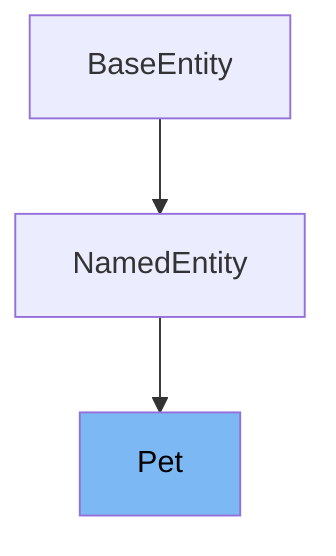

# Inheritance diagram

This diagram shows the inheritance tree of the class:



# What is Pet

The <SwmToken path="src/main/java/org/springframework/samples/petclinic/owner/Pet.java" pos="46:4:4" line-data="public class Pet extends NamedEntity {">`Pet`</SwmToken> class in <SwmPath>[src/…/owner/Pet.java](src/main/java/org/springframework/samples/petclinic/owner/Pet.java)</SwmPath> represents a simple business object for a pet within the PetClinic application. It is used to store and manage information related to individual pets, such as their birth date, type, and visits.

<SwmSnippet path="/src/main/java/org/springframework/samples/petclinic/owner/Pet.java" line="61">

---

The function <SwmToken path="src/main/java/org/springframework/samples/petclinic/owner/Pet.java" pos="61:5:5" line-data="	public void setBirthDate(LocalDate birthDate) {">`setBirthDate`</SwmToken> is used to set the birth date of the pet. It takes a <SwmToken path="src/main/java/org/springframework/samples/petclinic/owner/Pet.java" pos="61:7:7" line-data="	public void setBirthDate(LocalDate birthDate) {">`LocalDate`</SwmToken> object as a parameter and assigns it to the <SwmToken path="src/main/java/org/springframework/samples/petclinic/owner/Pet.java" pos="61:9:9" line-data="	public void setBirthDate(LocalDate birthDate) {">`birthDate`</SwmToken> variable.

```java
	public void setBirthDate(LocalDate birthDate) {
		this.birthDate = birthDate;
	}
```

---

</SwmSnippet>

<SwmSnippet path="/src/main/java/org/springframework/samples/petclinic/owner/Pet.java" line="65">

---

The function <SwmToken path="src/main/java/org/springframework/samples/petclinic/owner/Pet.java" pos="65:5:5" line-data="	public LocalDate getBirthDate() {">`getBirthDate`</SwmToken> is used to retrieve the birth date of the pet. It returns the <SwmToken path="src/main/java/org/springframework/samples/petclinic/owner/Pet.java" pos="66:5:5" line-data="		return this.birthDate;">`birthDate`</SwmToken> variable, which is a <SwmToken path="src/main/java/org/springframework/samples/petclinic/owner/Pet.java" pos="65:3:3" line-data="	public LocalDate getBirthDate() {">`LocalDate`</SwmToken> object.

```java
	public LocalDate getBirthDate() {
		return this.birthDate;
	}
```

---

</SwmSnippet>

<SwmSnippet path="/src/main/java/org/springframework/samples/petclinic/owner/Pet.java" line="69">

---

The function <SwmToken path="src/main/java/org/springframework/samples/petclinic/owner/Pet.java" pos="69:5:5" line-data="	public PetType getType() {">`getType`</SwmToken> is used to retrieve the type of the pet. It returns the <SwmToken path="src/main/java/org/springframework/samples/petclinic/owner/Pet.java" pos="70:5:5" line-data="		return this.type;">`type`</SwmToken> variable, which is an instance of <SwmToken path="src/main/java/org/springframework/samples/petclinic/owner/Pet.java" pos="69:3:3" line-data="	public PetType getType() {">`PetType`</SwmToken>.

```java
	public PetType getType() {
		return this.type;
	}
```

---

</SwmSnippet>

<SwmSnippet path="/src/main/java/org/springframework/samples/petclinic/owner/Pet.java" line="73">

---

The function <SwmToken path="src/main/java/org/springframework/samples/petclinic/owner/Pet.java" pos="73:5:5" line-data="	public void setType(PetType type) {">`setType`</SwmToken> is used to set the type of the pet. It takes a <SwmToken path="src/main/java/org/springframework/samples/petclinic/owner/Pet.java" pos="73:7:7" line-data="	public void setType(PetType type) {">`PetType`</SwmToken> object as a parameter and assigns it to the <SwmToken path="src/main/java/org/springframework/samples/petclinic/owner/Pet.java" pos="73:9:9" line-data="	public void setType(PetType type) {">`type`</SwmToken> variable.

```java
	public void setType(PetType type) {
		this.type = type;
	}
```

---

</SwmSnippet>

<SwmSnippet path="/src/main/java/org/springframework/samples/petclinic/owner/Pet.java" line="77">

---

The function <SwmToken path="src/main/java/org/springframework/samples/petclinic/owner/Pet.java" pos="77:8:8" line-data="	public Collection&lt;Visit&gt; getVisits() {">`getVisits`</SwmToken> is used to retrieve the collection of visits associated with the pet. It returns the <SwmToken path="src/main/java/org/springframework/samples/petclinic/owner/Pet.java" pos="78:5:5" line-data="		return this.visits;">`visits`</SwmToken> variable, which is a collection of <SwmToken path="src/main/java/org/springframework/samples/petclinic/owner/Pet.java" pos="77:5:5" line-data="	public Collection&lt;Visit&gt; getVisits() {">`Visit`</SwmToken> objects.

```java
	public Collection<Visit> getVisits() {
		return this.visits;
	}
```

---

</SwmSnippet>

<SwmSnippet path="/src/main/java/org/springframework/samples/petclinic/owner/Pet.java" line="81">

---

The function <SwmToken path="src/main/java/org/springframework/samples/petclinic/owner/Pet.java" pos="81:5:5" line-data="	public void addVisit(Visit visit) {">`addVisit`</SwmToken> is used to add a new visit to the pet's collection of visits. It takes a <SwmToken path="src/main/java/org/springframework/samples/petclinic/owner/Pet.java" pos="81:7:7" line-data="	public void addVisit(Visit visit) {">`Visit`</SwmToken> object as a parameter and adds it to the <SwmToken path="src/main/java/org/springframework/samples/petclinic/owner/Pet.java" pos="78:5:5" line-data="		return this.visits;">`visits`</SwmToken> collection.

```java
	public void addVisit(Visit visit) {
		getVisits().add(visit);
	}
```

---

</SwmSnippet>

# Usage

## VisitController

In the `VisitController`, the <SwmToken path="src/main/java/org/springframework/samples/petclinic/owner/Pet.java" pos="46:4:4" line-data="public class Pet extends NamedEntity {">`Pet`</SwmToken> class is used to retrieve a pet associated with an owner. The method `getPet` is called on an `Owner` object to obtain a specific pet by its ID, which is then added to the model for further processing.

## PetValidator

The `PetValidator` class uses the <SwmToken path="src/main/java/org/springframework/samples/petclinic/owner/Pet.java" pos="46:4:4" line-data="public class Pet extends NamedEntity {">`Pet`</SwmToken> class to perform validation checks. It ensures that the pet's name is not empty and supports validation specifically for <SwmToken path="src/main/java/org/springframework/samples/petclinic/owner/Pet.java" pos="46:4:4" line-data="public class Pet extends NamedEntity {">`Pet`</SwmToken> instances, confirming that the class being validated is assignable from <SwmToken path="src/main/java/org/springframework/samples/petclinic/owner/Pet.java" pos="46:4:4" line-data="public class Pet extends NamedEntity {">`Pet`</SwmToken>.

## Owner

Within the `Owner` class, <SwmToken path="src/main/java/org/springframework/samples/petclinic/owner/Pet.java" pos="46:4:4" line-data="public class Pet extends NamedEntity {">`Pet`</SwmToken> instances are managed as part of a list. The `Owner` class provides methods to add new pets, retrieve pets by name, and manage the collection of pets owned by an individual.

## PetController

The `PetController` utilizes the <SwmToken path="src/main/java/org/springframework/samples/petclinic/owner/Pet.java" pos="46:4:4" line-data="public class Pet extends NamedEntity {">`Pet`</SwmToken> class to handle pet creation and retrieval. It includes methods for initializing and processing forms related to pet creation, ensuring that new pets are added to an owner's collection and validating their uniqueness.

&nbsp;

*This is an auto-generated document by Swimm 🌊 and has not yet been verified by a human*

<SwmMeta version="3.0.0" repo-id="Z2l0aHViJTNBJTNBc3ByaW5nLXBldGNsaW5pYyUzQSUzQXVtYWxpbmdhc3dhbWk=" repo-name="spring-petclinic"><sup>Powered by [Swimm](/)</sup></SwmMeta>
