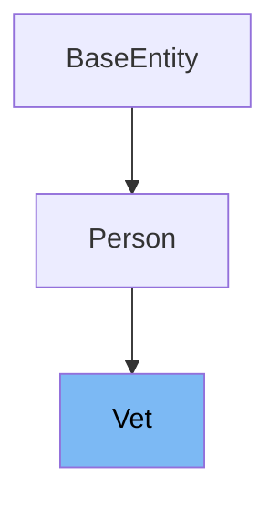

# Inheritance diagram

This diagram shows the inheritance tree of the class:



This document will cover the class Vet in the Spring PetClinic project. We will explore:

1. What Vet is and its purpose.
2. The variables and functions defined in Vet.

# What is Vet

The Vet class in the Spring PetClinic project is a <SwmToken path="src/main/java/org/springframework/samples/petclinic/vet/Vet.java" pos="36:5:5" line-data=" * Simple JavaBean domain object representing a veterinarian.">`JavaBean`</SwmToken> domain object representing a veterinarian. It extends the Person class and is annotated as an entity, indicating that it is a JPA entity mapped to the 'vets' table in the database. The Vet class is used to manage veterinarians' data, including their specialties.

<SwmSnippet path="/src/main/java/org/springframework/samples/petclinic/vet/Vet.java" line="52">

---

The function <SwmToken path="src/main/java/org/springframework/samples/petclinic/vet/Vet.java" pos="52:8:8" line-data="	protected Set&lt;Specialty&gt; getSpecialtiesInternal() {">`getSpecialtiesInternal`</SwmToken> is a protected method that initializes the <SwmToken path="src/main/java/org/springframework/samples/petclinic/vet/Vet.java" pos="53:6:6" line-data="		if (this.specialties == null) {">`specialties`</SwmToken> set if it is null and returns it. This method ensures that the <SwmToken path="src/main/java/org/springframework/samples/petclinic/vet/Vet.java" pos="53:6:6" line-data="		if (this.specialties == null) {">`specialties`</SwmToken> set is always available for internal operations.

```java
	protected Set<Specialty> getSpecialtiesInternal() {
		if (this.specialties == null) {
			this.specialties = new HashSet<>();
		}
		return this.specialties;
	}
```

---

</SwmSnippet>

<SwmSnippet path="/src/main/java/org/springframework/samples/petclinic/vet/Vet.java" line="59">

---

The function <SwmToken path="src/main/java/org/springframework/samples/petclinic/vet/Vet.java" pos="60:8:8" line-data="	public List&lt;Specialty&gt; getSpecialties() {">`getSpecialties`</SwmToken> returns a sorted list of specialties associated with the veterinarian. It uses the <SwmToken path="src/main/java/org/springframework/samples/petclinic/vet/Vet.java" pos="61:3:3" line-data="		return getSpecialtiesInternal().stream()">`getSpecialtiesInternal`</SwmToken> method to retrieve the specialties set and then sorts it by the name of each specialty.

```java
	@XmlElement
	public List<Specialty> getSpecialties() {
		return getSpecialtiesInternal().stream()
			.sorted(Comparator.comparing(NamedEntity::getName))
			.collect(Collectors.toList());
	}
```

---

</SwmSnippet>

<SwmSnippet path="/src/main/java/org/springframework/samples/petclinic/vet/Vet.java" line="66">

---

The function <SwmToken path="src/main/java/org/springframework/samples/petclinic/vet/Vet.java" pos="66:5:5" line-data="	public int getNrOfSpecialties() {">`getNrOfSpecialties`</SwmToken> returns the number of specialties associated with the veterinarian. It calls the <SwmToken path="src/main/java/org/springframework/samples/petclinic/vet/Vet.java" pos="67:3:3" line-data="		return getSpecialtiesInternal().size();">`getSpecialtiesInternal`</SwmToken> method to get the size of the specialties set.

```java
	public int getNrOfSpecialties() {
		return getSpecialtiesInternal().size();
	}
```

---

</SwmSnippet>

<SwmSnippet path="/src/main/java/org/springframework/samples/petclinic/vet/Vet.java" line="70">

---

The function <SwmToken path="src/main/java/org/springframework/samples/petclinic/vet/Vet.java" pos="70:5:5" line-data="	public void addSpecialty(Specialty specialty) {">`addSpecialty`</SwmToken> adds a new specialty to the veterinarian's specialties set. It uses the <SwmToken path="src/main/java/org/springframework/samples/petclinic/vet/Vet.java" pos="71:1:1" line-data="		getSpecialtiesInternal().add(specialty);">`getSpecialtiesInternal`</SwmToken> method to ensure the specialties set is initialized before adding the new specialty.

```java
	public void addSpecialty(Specialty specialty) {
		getSpecialtiesInternal().add(specialty);
	}
```

---

</SwmSnippet>

# Usage

## PetClinicRuntimeHints

In `PetClinicRuntimeHints`, the <SwmToken path="src/main/java/org/springframework/samples/petclinic/vet/Vet.java" pos="45:4:4" line-data="public class Vet extends Person {">`Vet`</SwmToken> class is registered for serialization. This indicates that instances of <SwmToken path="src/main/java/org/springframework/samples/petclinic/vet/Vet.java" pos="45:4:4" line-data="public class Vet extends Person {">`Vet`</SwmToken> can be serialized, which is useful for converting objects into a format that can be easily stored or transmitted.

## VetController

In `VetController`, the <SwmToken path="src/main/java/org/springframework/samples/petclinic/vet/Vet.java" pos="45:4:4" line-data="public class Vet extends Person {">`Vet`</SwmToken> class is used to manage the display of veterinarian information. The `showVetList` method retrieves a paginated list of <SwmToken path="src/main/java/org/springframework/samples/petclinic/vet/Vet.java" pos="45:4:4" line-data="public class Vet extends Person {">`Vet`</SwmToken> objects, which is then added to the model for rendering in the view. This allows users to view a list of veterinarians in the application.

## Vets

The `Vets` class contains a list of <SwmToken path="src/main/java/org/springframework/samples/petclinic/vet/Vet.java" pos="45:4:4" line-data="public class Vet extends Person {">`Vet`</SwmToken> objects. It provides a method `getVetList` to access this list, ensuring that it is initialized if it is null. This class is annotated with `@XmlRootElement`, indicating that it can be used in XML serialization, which is useful for data exchange in web services.

&nbsp;

*This is an auto-generated document by Swimm 🌊 and has not yet been verified by a human*

<SwmMeta version="3.0.0" repo-id="Z2l0aHViJTNBJTNBc3ByaW5nLXBldGNsaW5pYyUzQSUzQXVtYWxpbmdhc3dhbWk=" repo-name="spring-petclinic"><sup>Powered by [Swimm](/)</sup></SwmMeta>
