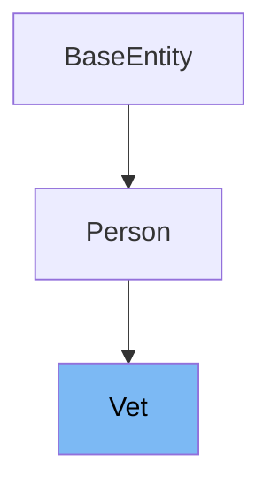

# Inheritance diagram

This diagram shows the inheritance tree of the class:



# What is Vet

The <SwmToken path="src/main/java/org/springframework/samples/petclinic/vet/Vet.java" pos="45:4:4" line-data="public class Vet extends Person {">`Vet`</SwmToken> class in <SwmPath>[src/…/vet/Vet.java](src/main/java/org/springframework/samples/petclinic/vet/Vet.java)</SwmPath> represents a veterinarian in the PetClinic application. It extends the <SwmToken path="src/main/java/org/springframework/samples/petclinic/vet/Vet.java" pos="25:12:12" line-data="import org.springframework.samples.petclinic.model.Person;">`Person`</SwmToken> class and is used to manage the specialties associated with a veterinarian.

<SwmSnippet path="/src/main/java/org/springframework/samples/petclinic/vet/Vet.java" line="52">

---

The function <SwmToken path="src/main/java/org/springframework/samples/petclinic/vet/Vet.java" pos="52:8:8" line-data="	protected Set&lt;Specialty&gt; getSpecialtiesInternal() {">`getSpecialtiesInternal`</SwmToken> is used to access the internal set of specialties associated with a veterinarian. It ensures that the <SwmToken path="src/main/java/org/springframework/samples/petclinic/vet/Vet.java" pos="53:6:6" line-data="		if (this.specialties == null) {">`specialties`</SwmToken> set is initialized before returning it.

```java
	protected Set<Specialty> getSpecialtiesInternal() {
		if (this.specialties == null) {
			this.specialties = new HashSet<>();
		}
		return this.specialties;
	}
```

---

</SwmSnippet>

<SwmSnippet path="/src/main/java/org/springframework/samples/petclinic/vet/Vet.java" line="59">

---

The function <SwmToken path="src/main/java/org/springframework/samples/petclinic/vet/Vet.java" pos="60:8:8" line-data="	public List&lt;Specialty&gt; getSpecialties() {">`getSpecialties`</SwmToken> returns a sorted list of specialties associated with a veterinarian. It uses the <SwmToken path="src/main/java/org/springframework/samples/petclinic/vet/Vet.java" pos="61:3:3" line-data="		return getSpecialtiesInternal().stream()">`getSpecialtiesInternal`</SwmToken> method to retrieve the specialties and sorts them by name.

```java
	@XmlElement
	public List<Specialty> getSpecialties() {
		return getSpecialtiesInternal().stream()
			.sorted(Comparator.comparing(NamedEntity::getName))
			.collect(Collectors.toList());
	}
```

---

</SwmSnippet>

<SwmSnippet path="/src/main/java/org/springframework/samples/petclinic/vet/Vet.java" line="66">

---

The function <SwmToken path="src/main/java/org/springframework/samples/petclinic/vet/Vet.java" pos="66:5:5" line-data="	public int getNrOfSpecialties() {">`getNrOfSpecialties`</SwmToken> returns the number of specialties associated with a veterinarian. It calls <SwmToken path="src/main/java/org/springframework/samples/petclinic/vet/Vet.java" pos="67:3:3" line-data="		return getSpecialtiesInternal().size();">`getSpecialtiesInternal`</SwmToken> to get the size of the specialties set.

```java
	public int getNrOfSpecialties() {
		return getSpecialtiesInternal().size();
	}
```

---

</SwmSnippet>

<SwmSnippet path="/src/main/java/org/springframework/samples/petclinic/vet/Vet.java" line="70">

---

The function <SwmToken path="src/main/java/org/springframework/samples/petclinic/vet/Vet.java" pos="70:5:5" line-data="	public void addSpecialty(Specialty specialty) {">`addSpecialty`</SwmToken> adds a new specialty to the veterinarian's set of specialties. It uses <SwmToken path="src/main/java/org/springframework/samples/petclinic/vet/Vet.java" pos="71:1:1" line-data="		getSpecialtiesInternal().add(specialty);">`getSpecialtiesInternal`</SwmToken> to ensure the specialties set is initialized before adding the new specialty.

```java
	public void addSpecialty(Specialty specialty) {
		getSpecialtiesInternal().add(specialty);
	}
```

---

</SwmSnippet>

# Usage

## Vets

The class <SwmToken path="src/main/java/org/springframework/samples/petclinic/vet/Vet.java" pos="45:4:4" line-data="public class Vet extends Person {">`Vet`</SwmToken> is utilized within the `Vets` class, where it is part of a list that represents multiple veterinarians. This list is managed through methods that ensure the list is initialized and populated as needed.

## PetClinicRuntimeHints

In `PetClinicRuntimeHints`, the <SwmToken path="src/main/java/org/springframework/samples/petclinic/vet/Vet.java" pos="45:4:4" line-data="public class Vet extends Person {">`Vet`</SwmToken> class is registered for serialization, indicating that instances of <SwmToken path="src/main/java/org/springframework/samples/petclinic/vet/Vet.java" pos="45:4:4" line-data="public class Vet extends Person {">`Vet`</SwmToken> can be serialized, which is essential for data persistence and transfer.

## VetController

The `VetController` class uses <SwmToken path="src/main/java/org/springframework/samples/petclinic/vet/Vet.java" pos="45:4:4" line-data="public class Vet extends Person {">`Vet`</SwmToken> to manage and display lists of veterinarians. It handles HTTP requests to show a paginated list of vets, utilizing the `Vets` class to simplify object-XML mapping and manage pagination details.

&nbsp;

*This is an auto-generated document by Swimm 🌊 and has not yet been verified by a human*

<SwmMeta version="3.0.0" repo-id="Z2l0aHViJTNBJTNBc3ByaW5nLXBldGNsaW5pYyUzQSUzQXVtYWxpbmdhc3dhbWk=" repo-name="spring-petclinic"><sup>Powered by [Swimm](/)</sup></SwmMeta>
