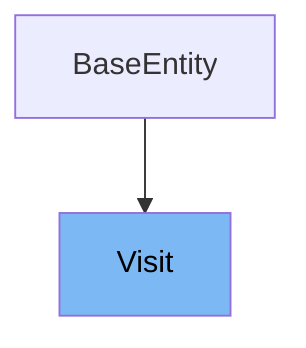

# Inheritance diagram

This diagram shows the inheritance tree of the class:



# What is Visit

The <SwmToken path="src/main/java/org/springframework/samples/petclinic/owner/Visit.java" pos="48:3:3" line-data="	public Visit() {">`Visit`</SwmToken> class in <SwmPath>[src/…/owner/Visit.java](src/main/java/org/springframework/samples/petclinic/owner/Visit.java)</SwmPath> represents a domain object for a visit in the pet clinic application. It is used to store information about a pet's visit, including the date and description of the visit.

<SwmSnippet path="/src/main/java/org/springframework/samples/petclinic/owner/Visit.java" line="48">

---

The constructor <SwmToken path="src/main/java/org/springframework/samples/petclinic/owner/Visit.java" pos="48:3:3" line-data="	public Visit() {">`Visit`</SwmToken> is used to create a new instance of the <SwmToken path="src/main/java/org/springframework/samples/petclinic/owner/Visit.java" pos="48:3:3" line-data="	public Visit() {">`Visit`</SwmToken> class. It initializes the <SwmToken path="src/main/java/org/springframework/samples/petclinic/owner/Visit.java" pos="49:3:3" line-data="		this.date = LocalDate.now();">`date`</SwmToken> variable to the current date.

```java
	public Visit() {
		this.date = LocalDate.now();
	}
```

---

</SwmSnippet>

<SwmSnippet path="/src/main/java/org/springframework/samples/petclinic/owner/Visit.java" line="52">

---

The function <SwmToken path="src/main/java/org/springframework/samples/petclinic/owner/Visit.java" pos="52:5:5" line-data="	public LocalDate getDate() {">`getDate`</SwmToken> is used to retrieve the date of the visit. It returns the <SwmToken path="src/main/java/org/springframework/samples/petclinic/owner/Visit.java" pos="53:5:5" line-data="		return this.date;">`date`</SwmToken> variable.

```java
	public LocalDate getDate() {
		return this.date;
	}
```

---

</SwmSnippet>

<SwmSnippet path="/src/main/java/org/springframework/samples/petclinic/owner/Visit.java" line="56">

---

The function <SwmToken path="src/main/java/org/springframework/samples/petclinic/owner/Visit.java" pos="56:5:5" line-data="	public void setDate(LocalDate date) {">`setDate`</SwmToken> is used to set the date of the visit. It updates the <SwmToken path="src/main/java/org/springframework/samples/petclinic/owner/Visit.java" pos="56:9:9" line-data="	public void setDate(LocalDate date) {">`date`</SwmToken> variable with the provided date.

```java
	public void setDate(LocalDate date) {
		this.date = date;
	}
```

---

</SwmSnippet>

<SwmSnippet path="/src/main/java/org/springframework/samples/petclinic/owner/Visit.java" line="60">

---

The function <SwmToken path="src/main/java/org/springframework/samples/petclinic/owner/Visit.java" pos="60:5:5" line-data="	public String getDescription() {">`getDescription`</SwmToken> is used to retrieve the description of the visit. It returns the <SwmToken path="src/main/java/org/springframework/samples/petclinic/owner/Visit.java" pos="61:5:5" line-data="		return this.description;">`description`</SwmToken> variable.

```java
	public String getDescription() {
		return this.description;
	}
```

---

</SwmSnippet>

<SwmSnippet path="/src/main/java/org/springframework/samples/petclinic/owner/Visit.java" line="64">

---

The function <SwmToken path="src/main/java/org/springframework/samples/petclinic/owner/Visit.java" pos="64:5:5" line-data="	public void setDescription(String description) {">`setDescription`</SwmToken> is used to set the description of the visit. It updates the <SwmToken path="src/main/java/org/springframework/samples/petclinic/owner/Visit.java" pos="64:9:9" line-data="	public void setDescription(String description) {">`description`</SwmToken> variable with the provided description.

```java
	public void setDescription(String description) {
		this.description = description;
	}
```

---

</SwmSnippet>

# Usage

## VisitController

In the `VisitController`, the <SwmToken path="src/main/java/org/springframework/samples/petclinic/owner/Visit.java" pos="48:3:3" line-data="	public Visit() {">`Visit`</SwmToken> class is used to load a pet with its associated visit details. The method `loadPetWithVisit` creates a new <SwmToken path="src/main/java/org/springframework/samples/petclinic/owner/Visit.java" pos="48:3:3" line-data="	public Visit() {">`Visit`</SwmToken> instance and associates it with a pet, returning the visit object.

## VisitController

Additionally, the <SwmToken path="src/main/java/org/springframework/samples/petclinic/owner/Visit.java" pos="48:3:3" line-data="	public Visit() {">`Visit`</SwmToken> class is utilized in the `processNewVisitForm` method to handle form submissions for new visits. It checks for validation errors and returns the appropriate view.

## Pet

In the `Pet` class, <SwmToken path="src/main/java/org/springframework/samples/petclinic/owner/Visit.java" pos="48:3:3" line-data="	public Visit() {">`Visit`</SwmToken> objects are managed within a collection. The `addVisit` method allows adding a new <SwmToken path="src/main/java/org/springframework/samples/petclinic/owner/Visit.java" pos="48:3:3" line-data="	public Visit() {">`Visit`</SwmToken> to a pet's visit history, while `getVisits` retrieves all visits associated with the pet.

## Visit

The <SwmToken path="src/main/java/org/springframework/samples/petclinic/owner/Visit.java" pos="48:3:3" line-data="	public Visit() {">`Visit`</SwmToken> class itself is defined as an entity representing a visit record. It includes attributes such as the visit date and description, and initializes the visit date to the current date upon creation.

&nbsp;

*This is an auto-generated document by Swimm 🌊 and has not yet been verified by a human*

<SwmMeta version="3.0.0" repo-id="Z2l0aHViJTNBJTNBc3ByaW5nLXBldGNsaW5pYyUzQSUzQXVtYWxpbmdhc3dhbWk=" repo-name="spring-petclinic"><sup>Powered by [Swimm](/)</sup></SwmMeta>
