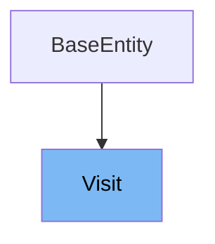

# Inheritance diagram

This diagram shows the inheritance tree of the class:



This document will cover the class Visit in the Spring PetClinic project. We will explore:

1. What Visit is and its purpose.
2. Variables and functions defined in Visit.

# What is Visit

The Visit class in the Spring PetClinic project is a <SwmToken path="src/main/java/org/springframework/samples/petclinic/owner/Visit.java" pos="29:5:5" line-data=" * Simple JavaBean domain object representing a visit.">`JavaBean`</SwmToken> domain object that represents a visit to the clinic. It is used to store information about a specific visit, including the date and description of the visit. This class extends <SwmToken path="src/main/java/org/springframework/samples/petclinic/owner/Visit.java" pos="21:12:12" line-data="import org.springframework.samples.petclinic.model.BaseEntity;">`BaseEntity`</SwmToken>, indicating that it is a persistent entity in the application's database.

<SwmSnippet path="/src/main/java/org/springframework/samples/petclinic/owner/Visit.java" line="48">

---

The function <SwmToken path="src/main/java/org/springframework/samples/petclinic/owner/Visit.java" pos="48:3:3" line-data="	public Visit() {">`Visit`</SwmToken> is a constructor used to create a new instance of the Visit class. It initializes the visit date to the current date using <SwmToken path="src/main/java/org/springframework/samples/petclinic/owner/Visit.java" pos="49:7:11" line-data="		this.date = LocalDate.now();">`LocalDate.now()`</SwmToken>.

```java
	public Visit() {
		this.date = LocalDate.now();
	}
```

---

</SwmSnippet>

<SwmSnippet path="/src/main/java/org/springframework/samples/petclinic/owner/Visit.java" line="52">

---

The function <SwmToken path="src/main/java/org/springframework/samples/petclinic/owner/Visit.java" pos="52:5:5" line-data="	public LocalDate getDate() {">`getDate`</SwmToken> is used to retrieve the date of the visit. It returns the value of the <SwmToken path="src/main/java/org/springframework/samples/petclinic/owner/Visit.java" pos="53:5:5" line-data="		return this.date;">`date`</SwmToken> variable.

```java
	public LocalDate getDate() {
		return this.date;
	}
```

---

</SwmSnippet>

<SwmSnippet path="/src/main/java/org/springframework/samples/petclinic/owner/Visit.java" line="56">

---

The function <SwmToken path="src/main/java/org/springframework/samples/petclinic/owner/Visit.java" pos="56:5:5" line-data="	public void setDate(LocalDate date) {">`setDate`</SwmToken> is used to set the date of the visit. It assigns the provided <SwmToken path="src/main/java/org/springframework/samples/petclinic/owner/Visit.java" pos="56:9:9" line-data="	public void setDate(LocalDate date) {">`date`</SwmToken> parameter to the <SwmToken path="src/main/java/org/springframework/samples/petclinic/owner/Visit.java" pos="56:9:9" line-data="	public void setDate(LocalDate date) {">`date`</SwmToken> variable.

```java
	public void setDate(LocalDate date) {
		this.date = date;
	}
```

---

</SwmSnippet>

<SwmSnippet path="/src/main/java/org/springframework/samples/petclinic/owner/Visit.java" line="60">

---

The function <SwmToken path="src/main/java/org/springframework/samples/petclinic/owner/Visit.java" pos="60:5:5" line-data="	public String getDescription() {">`getDescription`</SwmToken> is used to retrieve the description of the visit. It returns the value of the <SwmToken path="src/main/java/org/springframework/samples/petclinic/owner/Visit.java" pos="61:5:5" line-data="		return this.description;">`description`</SwmToken> variable.

```java
	public String getDescription() {
		return this.description;
	}
```

---

</SwmSnippet>

<SwmSnippet path="/src/main/java/org/springframework/samples/petclinic/owner/Visit.java" line="64">

---

The function <SwmToken path="src/main/java/org/springframework/samples/petclinic/owner/Visit.java" pos="64:5:5" line-data="	public void setDescription(String description) {">`setDescription`</SwmToken> is used to set the description of the visit. It assigns the provided <SwmToken path="src/main/java/org/springframework/samples/petclinic/owner/Visit.java" pos="64:9:9" line-data="	public void setDescription(String description) {">`description`</SwmToken> parameter to the <SwmToken path="src/main/java/org/springframework/samples/petclinic/owner/Visit.java" pos="64:9:9" line-data="	public void setDescription(String description) {">`description`</SwmToken> variable.

```java
	public void setDescription(String description) {
		this.description = description;
	}
```

---

</SwmSnippet>

# Usage

## Pet

In the `Pet` class, <SwmToken path="src/main/java/org/springframework/samples/petclinic/owner/Visit.java" pos="48:3:3" line-data="	public Visit() {">`Visit`</SwmToken> objects are managed within a `Set` collection. This collection is initialized with a `LinkedHashSet` to maintain the order of visits by date. The `Pet` class provides methods to retrieve and add <SwmToken path="src/main/java/org/springframework/samples/petclinic/owner/Visit.java" pos="48:3:3" line-data="	public Visit() {">`Visit`</SwmToken> objects, allowing for the association of multiple visits with a single pet.

## VisitController

The `VisitController` class handles the creation and processing of new visits. It uses the <SwmToken path="src/main/java/org/springframework/samples/petclinic/owner/Visit.java" pos="48:3:3" line-data="	public Visit() {">`Visit`</SwmToken> class to create new visit instances and associate them with pets. The method `loadPetWithVisit` initializes a <SwmToken path="src/main/java/org/springframework/samples/petclinic/owner/Visit.java" pos="48:3:3" line-data="	public Visit() {">`Visit`</SwmToken> object and adds it to the pet's collection of visits. Additionally, the `processNewVisitForm` method processes the form submission for creating a new visit, validating the input and redirecting as necessary.

&nbsp;

*This is an auto-generated document by Swimm 🌊 and has not yet been verified by a human*

<SwmMeta version="3.0.0" repo-id="Z2l0aHViJTNBJTNBc3ByaW5nLXBldGNsaW5pYyUzQSUzQXVtYWxpbmdhc3dhbWk=" repo-name="spring-petclinic"><sup>Powered by [Swimm](/)</sup></SwmMeta>
